# HotKey

<p align="center"></p>
<p align="center">사용자가 이용하고 있는 프로그램의 단축키 정보를 검색하지말고 바로 알아보자!</p>

# HotKey 앱 다운로드

[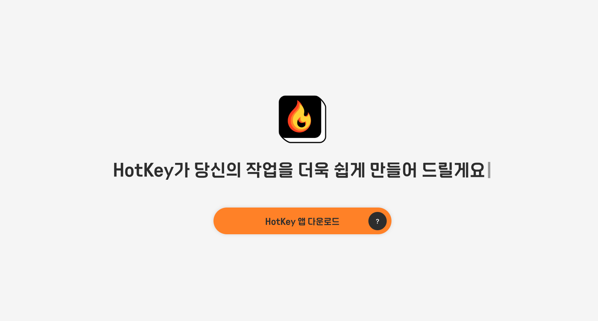](https://hotkey-v2.netlify.app/)

# 목차

1. [개발 배경](#개발-배경)
   - [알아두면 유용한 단축키 정보를 검색하지 않고 바로 알 수는 없을까?](#알아두면-유용한-단축키-정보를-검색하지-않고-바로-알-수는-없을까)
2. [HotKey 기능 미리보기](#hotkey-기능-미리보기)
   - [⌘ Command 롱프레스로 단축키 정보 수집](#-command-롱프레스로-단축키-정보-수집)
   - [필터링된 단축키 정보 안내](#필터링된-단축키-정보-안내)
   - [가상키보드를 통한 키보드 액션](#가상키보드를-통한-키보드-액션)
3. [기술 스택 + 선정 이유](#기술-스택--선정-이유)
   - [Frontend](#frontend)
   - [Build Tools & Libraries](#build-tools--libraries)
   - [Development Tools](#development-tools)
4. [개발 과정](#개발-과정)
   - [앱 접근성 향상을 위해 개인정보 보호 설정 해제 팝업창 띄우기](#앱-접근성-향상을-위해-개인정보-보호-설정-해제-팝업창-띄우기)
   - [앱 실행 시 ProgressBar 만들기](#앱-실행-시-progressbar-만들기)
   - [사용자의 활성화된 앱 메뉴바 정보 가져오기](#사용자의-활성화된-앱-메뉴바-정보-가져오기)
   - [UI 고려사항](#ui-고려사항)
   - [전역 키 리스너 및 Command 롱프레스 활성화 기능](#전역-키-리스너-및-command-롱프레스-활성화-기능)
5. [개발 과정에서 부딪쳤던 이슈](#개발-과정에서-부딪쳤던-이슈)
   - [UI 스크랩핑 시간 소요 이슈](#ui-스크랩핑-시간-소요-이슈)
   - [단축키 아이콘 실제 UI와 다른 이슈](#단축키-아이콘-실제-ui와-다른-이슈)
   - [HotKey앱 다운로드 파일 용량 초과 이슈](#hotkey앱-다운로드-파일-용량-초과-이슈)
   - [빌드 크기 최적화 (DMG 203MB → 96MB)](#빌드-크기-최적화-dmg-203mb--96mb)
6. [회고록](#회고록)

# 개발 배경

### **알아두면 유용한 단축키 정보를 검색하지 않고 바로 알 수는 없을까?**

작업속도를 빠르게 향상시키기 위해 단축키를 검색하지 않고 바로 알고 싶었습니다.<br>
과거 퍼블리셔로 일하면서 디자인 작업도 병행한 경험이 있었는데 그 당시에는 보안이 철저한 근무 환경으로<br>
피그마와 같은 외부 라이브러리 프로그램 사용할 수 없어 주로 포토샵과 일러스트레이터를 사용했습니다.

하지만 프론트엔드 부트캠프를 진행하면서 피그마를 접하게 되었고, 포토샵과 상이한 단축키들이 있음을 알게 되어,<br>
작업 중에 단축키를 일일이 검색하는 것이 번거롭다는 점을 느꼈습니다.

이 불편함을 해결하기 위해 단축키 안내 프로그램을 직접 개발하면<br>
훨씬 더 효율적으로 작업할 수 있을 것 같아 해당 프로젝트를 시작하게 되었습니다.

# HotKey 기능 미리보기

### ⌘ Command 롱프레스로 단축키 정보 수집

앱이 실행되면 접근성 권한이 없을 경우 시스템 설정이 자동으로 열리고<br>
가이드 안내 페이지에서 권한 허용 방법과 사용 흐름을 안내합니다.<br>
`사용시작` 버튼을 클릭 후 단축키를 확인할 앱을 활성화하고 `⌘ Command` 키를 **2초간 꾹 누르면**<br>
마우스 커서 위치 근처에 HotKey가 활성화되며 해당 앱의 메뉴바 단축키 정보를 수집합니다.<br>
원형 프로그레스바로 진행률을 실시간으로 확인할 수 있습니다.

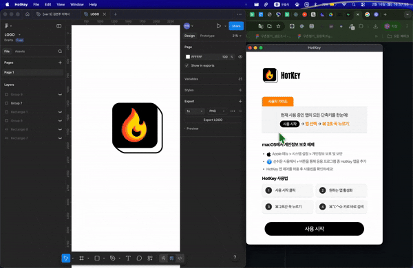

### 필터링된 단축키 정보 안내

데이터를 불러오는 동안 로딩 애니메이션이 나타나고 실행했던 앱의 단축키 정보가 보여진 후,
사용자가 특수기호를 입력했을 때 필터링된 단축키가 나타납니다.


### 가상키보드를 통한 키보드 액션

사용자의 키보드 액션을 감지하여 키보드뷰어내에 사용자가 어떤 키보드를 눌렀는지
직관적인 UI를 통해 사용자가 키 입력을 인식하기 쉽게 만들어줍니다.

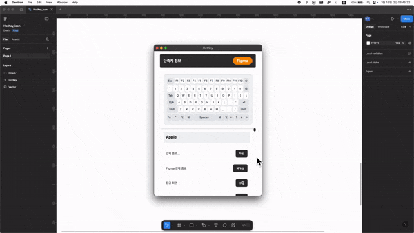

# 기술 스택 + 선정 이유

### Frontend


- **컴포넌트 기반 구조**<br>
  UI를 작은 컴포넌트로 나누어 관리하고, 재사용하며 유지보수와 확장성 측면에 유리합니다.

- **빠르고 동적인 UI**<br>
  React의 상태 관리와 프로젝트 기능 중 키보드 액션을 가상키보드내에 동적인 UI를 제공하기 위해서 사용하기에 적합하다고 판단하였습니다.

- **호환성**<br>
  React는 다양한 라이브러리, 도구, 플러그인과 호환되므로 Tailwind, GitHub Release 등과 쉽게 통합 가능하다고 판단하였습니다.


- **타입 안정성**<br>
  정적 타입 검사를 통해 런타임 에러를 사전에 방지하고, 코드의 안정성과 예측 가능성을 높입니다.

- **개발 생산성 향상**<br>
  IDE의 자동완성, 타입 추론, 리팩토링 지원 기능을 통해 개발 속도와 코드 품질을 동시에 향상시킵니다.

- **FSD 아키텍처 적용**<br>
  Feature-Sliced Design 구조와 함께 TypeScript를 도입하여 확장 가능하고 유지보수가 용이한 코드베이스를 구축하였습니다.
  기능별로 분리된 커스텀 훅(`useKeyTracking`, `useAppDetection`, `useFilteredMenu`)을 통해
  관심사 분리와 재사용성을 극대화하였습니다.

- **절대 경로 마이그레이션**<br>
  `@/` 경로 별칭을 통해 상대 경로의 복잡성을 제거하고 가독성을 향상시켰습니다.


- **웹 기술을 사용한 데스크탑 앱 개발**<br>
  HTML, CSS, JavaScript을 통해 웹 개발을 진행한 적이 있어 3주의 단기 프로젝트 기간동안 적용하기에 적합하다고 판단하였습니다.

- **강력한 Node.js 통합**<br>
  일렉트론은 Node.js와 통합되어 있어 파일 시스템 접근, 데이터베이스 연결, 네트워크 요청 처리 등 다양한 서버 측 작업을 하기에 수월하다고 판단하였습니다.


- **유틸리티 퍼스트 접근법**<br>
  유틸리티 클래스를 제공하여 CSS 파일을 따로 작성하지 않고 HTML 코드에서 직접 스타일을 적용하여 필요한 스타일을 빠르고 유연하게 대응할 수 있다는 점이 매력적으로 느껴져 선정하게 되었습니다.

- **Tailwind CSS 4.0 업데이트**<br>
  최신 버전에서 제공하는 새로운 엔진과 개선된 성능을 활용하여 더 빠른 빌드 시간과 향상된 개발 경험을 제공합니다.


- **macOS 시스템 환경 제어 가능**<br>
  Electron 애플리케이션 내에서 AppleScript를 사용하면 macOS에서만 제공하는 시스템 환경을 제어할 수 있기에
  사용자의 시스템 앱의 메뉴바에 접근하기에 적합하다고 판단하였습니다.

- **비동기 작업 처리**<br>
  Electron 환경에서는 child_process 모듈을 사용하여 비동기적으로 AppleScript를 실행할 수 있습니다.
  이로 인해 애플리케이션의 UI가 멈추지 않고 원활하게 실행됩니다.

---

### Build Tools & Libraries


- **번들링 시간 단축**<br>

  기존 Electron은 Webpack을 사용하여 번들링하는 방식에서 Vite 7의 최신 빌드 최적화와 ESBuild 기반 번들링으로 개발 및 프로덕션 빌드 시간을 크게 단축시켰습니다.

- **빠른 UI 실행 속도**<br>
  React 19와 Tailwind CSS 4를 사용하여 UI를 개발할 때,
  Vite 7의 향상된 성능 덕분에 더욱 빠른 개발 환경을 제공합니다.

- **핫 모듈 리로드(HMR)**<br>
  Vite의 HMR(핫 모듈 리로드) 기능 덕분에 코드의 변경 사항이 즉시 반영됩니다.
  이는 빠르게 프로토타입을 만들고 테스트할 수 있게 하며, 프로젝트를 개선하는 데 유리합니다.


- **설정 없이 바로 사용 가능**<br>
  Zustand는 복잡한 설정 없이 바로 사용할 수 있습니다.
  Redux와 같은 상태 관리 라이브러리에서는 액션, 리듀서, 스토어 등을 설정하지만
  반면에 Zustand는 이러한 설정이 필요 없어서 상태 관리가 매우 간단하고 직관적입니다.

- **자동 리렌더링 최적화**<br>
  상태를 업데이트할 때 변경된 부분만 리렌더링하도록 최적화됩니다.
  이로 인해 불필요한 리렌더링을 방지하고 애플리케이션 성능을 최적화할 수 있습니다.

- **useShallow를 통한 배치 업데이트**<br>
  `zustand/react/shallow`의 useShallow 훅을 활용하여 여러 상태값을 효율적으로 구독하고,
  불필요한 리렌더링을 방지하는 배치 업데이트를 구현하였습니다.


- **전역 키보드 이벤트 감지**<br>
  앱이 포커스되지 않은 상태에서도 키보드 입력을 감지할 수 있어,
  Command 롱프레스 활성화 기능을 구현하는 데 핵심적인 역할을 합니다.

- **크로스 플랫폼 지원**<br>
  macOS, Windows, Linux에서 동일한 API로 전역 키보드 이벤트를 처리할 수 있습니다.

---

### Development Tools


- **자동화된 코드 포매팅**<br>
  수동으로 코드 스타일을 맞추지 않아도 되므로 코드 스타일에
  신경 쓸 필요가 없어 일관된 코드 스타일을 위해 선정하였습니다.

- **생산성 향상**<br>
  자동화된 도구가 포매팅을 대신 처리하므로, 기능 구현에 더 많은 시간을 할애할 수 있습니다.


- **버그 예방**<br>
  코드에서 발생할 수 있는 잠재적인 버그를 사전에 찾아주는 장점이 있습니다.


- **패키지 관리의 효율성**<br>
  Homebrew를 사용하면 필요한 도구나 라이브러리를 간단히 설치하여 효율성이 높다고 판단하였습니다.

# 개발 과정

### 앱 접근성 향상을 위해 개인정보 보호 설정 해제 팝업창 띄우기

#### 1. shell.openExternal + app.whenReady 사용

| **shell.openExternal**                                                                                                                                                                                    | **app.whenReady()**                                                                                                                                                                |
| --------------------------------------------------------------------------------------------------------------------------------------------------------------------------------------------------------- | ---------------------------------------------------------------------------------------------------------------------------------------------------------------------------------- |
| shell 모듈의 openExternal 메서드는 외부 링크를 열 때 사용됩니다.                                                                                                                                          | Electron 애플리케이션이 준비가 완료되었을 때 호출되는 프로미스를 반환하며, 이는 애플리케이션의 초기화가 끝나고, 이벤트 루프가 시작된 상태에서 특정 작업을 수행할 수 있게 해줍니다. |
| x-apple.systempreferences는 시스템 환경설정 앱을 실행하는 특정 URL 스킴이고, com.apple.preference.security는 보안 설정의 항목을 지정하여 Privacy 파라미터는 개인 정보 보호 섹션으로 바로 이동하게 합니다. | 애플리케이션이 whenReady()를 통해 준비된 후에만 창을 생성하게끔 구현되어있습니다.                                                                                                  |

```typescript
const openSecuritySet = () => {
  shell.openExternal(
    "x-apple.systempreferences:com.apple.preference.security?Privacy"
  );
};

app.whenReady().then(() => {
  openSecuritySet();
});
```

### 앱 실행 시 ProgressBar 만들기

#### 1. **React Hook 사용 (useState, useRef, useEffect)**

| useState                                                                                                                  | useRef                                                                                                                                                                                                                                | useEffect                                                                                                                                                                               |
| ------------------------------------------------------------------------------------------------------------------------- | ------------------------------------------------------------------------------------------------------------------------------------------------------------------------------------------------------------------------------------- | --------------------------------------------------------------------------------------------------------------------------------------------------------------------------------------- |
| 프로그레스 바의 진행 상황이 실시간으로 반영되어 UI가 자연스럽게 보여지게끔 로딩 진행 상태를 관리하기 위해 사용하였습니다. | useRef는 UI가 자동으로 업데이트되지 않습니다. 그 이유는 상태를 관리하는 것이 아니라 컴포넌트 리렌더링을 유발하지 않으면서 값만 추적할 때 사용되기에 `animationFrameId`를 추적하여, `requestAnimationFrame`을 취소할 수 있도록 합니다. | 컴포넌트가 처음 렌더링될 때 실행되는 사이드 이펙트를 관리하는 훅이며, 로딩 애니메이션이 시작하고 애니메이션이 끝나면 `navigate("/main")`을 호출하여 페이지를 이동시키도록 해두었습니다. |

#### 2. **로딩 애니메이션 구현**

| requestAnimationFrame                                                                                                                                                                                | performance.now                                                                                                                                                 | Math.min                                                                                                                                                                    |
| ---------------------------------------------------------------------------------------------------------------------------------------------------------------------------------------------------- | --------------------------------------------------------------------------------------------------------------------------------------------------------------- | --------------------------------------------------------------------------------------------------------------------------------------------------------------------------- |
| 브라우저에서 애니메이션을 최적화하여 실행할 수 있도록 해주는 함수로 화면을 부드럽게 갱신하기 위해서 애니메이션을 호출할 때마다 화면이 깜박이지 않도록 최적화된 방식으로 애니메이션을 구현하였습니다. | 현재 시간을 밀리초 단위로 높은 정밀도로 반환하는 함수로 `Date.now()` 와 비슷하지만, 로딩 진행 상태를 계산할 때 정확한 경과 시간을 추적하기 위해 사용하였습니다. | 주어진 여러 숫자 중 가장 작은 값을 반환하는 함수로 진행률이 100이라면 해당 수를 초과하지 않도록 최대값 제한을 설정하여 로딩 애니메이션의 정확한 종료 시점을 확인하였습니다. |

---

### 사용자의 활성화된 앱 메뉴바 정보 가져오기

| **AppleScript 사용 (osascript)**                                                                                                                                  | **TypeScript의 `exec` 함수 사용**                                                                                                                                                     |
| ----------------------------------------------------------------------------------------------------------------------------------------------------------------- | ------------------------------------------------------------------------------------------------------------------------------------------------------------------------------------- |
| **AppleScript**는 문자열 기반의 스크립트 언어로 외부 프로그램과 상호작용할 때 문자열을 전달하고 실행할 명령이나 데이터를 문자열 형식으로 표현해야 합니다.         | `exec` 함수는 외부 명령어를 실행하고, 해당 명령어의 표준 출력(stdout)과 표준 에러(stderr)를 반환받을 수 있게 해주는 함수입니다. 실행이 끝나면 콜백 함수가 호출되어 결과를 처리합니다. |
| AppleScript 자체로는 macOS 상단 메뉴바의 모든 정보나 아이콘을 추출할 수 없고, **System Events** 애플리케이션을 사용하여 메뉴바 항목을 탐색하고 정보를 가져옵니다. | `osascript`는 터미널을 통해 AppleScript를 실행하고 결과를 받을 수 있는 명령어 라인 도구입니다.<br> 결과는 `"메뉴명 > 항목명 \| 단축키"` 형식으로 반환됩니다.                          |
| `repeat with mb in menu bar items of menu bar 1`로 메뉴바 항목을 순회하고, `repeat with mi in menu items of menu 1 of mb`로 각 메뉴의 하위 항목들을 처리합니다.   | 파싱된 결과는 `stdout.trim().split(", ")`로 분리 후 `normalizeShortcut` 함수를 통해 특수 키 심볼을 변환하여 최종 `MenuItem[]` 배열로 반환합니다.                                      |
| 단축키 정보는 `sc` 변수에 저장되며, 모디파이어(`mods`)와 키 문자(`glyphChar`)를 결합하여 생성합니다. 에러 발생 시 `try` 블록으로 안전하게 처리합니다.             | 실패할 경우 `reject`를 호출하여 에러 처리 핸들링을 하였습니다.                                                                                                                        |

#### 동적 앱 감지 기능 추가

| **기능**   | **설명**                                                                                                                                                    |
| ---------------------------- | ----------------------------------------------------------------------------------------------------------------------------------------------------------- |
| **실시간 활성화 앱 감지**    | AppleScript의 `frontmost application` 속성을 활용하여 현재 활성화된 앱을 실시간으로 감지합니다.                                                             |
| **앱 전환 시 자동 업데이트** | 사용자가 다른 앱으로 전환할 때 자동으로 새로운 앱의 메뉴바 단축키 정보를 수집하고 UI에 반영합니다.                                                          |
| **AppleScript 로직 간소화**  | 기존의 복잡한 스크립트 구조를 간소화하여 앱 이름을 동적으로 전달받아 처리하도록 개선하였습니다. 이를 통해 코드의 유지보수성과 실행 효율성이 향상되었습니다. |

#### 단축키 추출 및 심볼 변환 처리

AppleScript의 Accessibility 속성을 활용하여 메뉴바 단축키를 추출하고, macOS 표준 심볼로 변환합니다.

| **처리 항목**  | **사용 속성**            | **설명**                                                           |
| -------------------------------- | ------------------------------------------ | ------------------------------------------------------------------ |
| **모디파이어 키**                | `AXMenuItemCmdModifiers`                   | 비트 연산으로 ⌃, ⌥, ⇧, ⌘ 조합 판별 (macOS 표준 순서)               |
| **단축키 문자**                  | `AXMenuItemCmdKey` / `AXMenuItemCmdChar`   | 단축키의 키 문자(예: C, S, B) 추출                                 |
| **Function 키**                  | `AXMenuItemCmdVirtualKey`                  | Virtual Key Code 기반 F1~F15 매핑                                  |
| **특수 키 심볼**                 | `AXMenuItemCmdGlyph` + `normalizeShortcut` | Tab(⇥), Delete(⌫), Escape(⎋), 방향키(←→↑↓) 등 macOS 표준 심볼 변환 |

모디파이어와 키 문자를 결합하여 `⌘C`, `⌃⌥⇧D`와 같은 최종 단축키를 생성하며,
TypeScript의 `normalizeShortcut` 함수에서 charCode 기반 특수 키를 macOS 심볼로 추가 변환합니다.

---

### UI 고려사항

#### 1. **로딩 화면 UI**

작업환경영역에 침범하여 화면을 번갈아보기에 불편함을 예상하여 특수기호 입력 시
커닝페이퍼처럼 안내해 주는 액션을 통해 디스플레이내에 큰 비율을 차지하지 않도록 수정하였으며,
시작 전 Loading이란 워딩이 사용자에게 거부감을 들 수 있게 할 것 같아 전체 안내 문구 `~해요체` 로 안내 메시지 변경하였습니다.

| **초기 화면**                                                                       | **개선 화면**                                                                      |
| ----------------------------------------------------------------------------------- | ---------------------------------------------------------------------------------- |
| 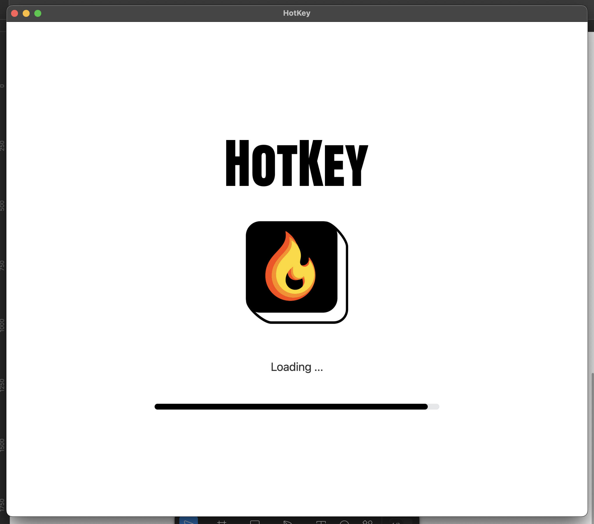 | 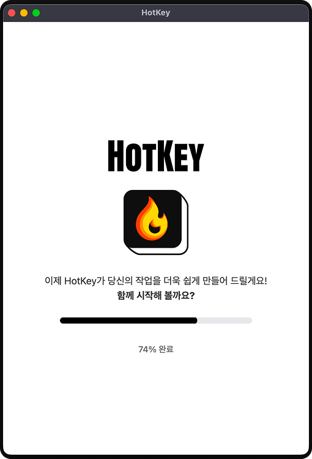 |

#### 2. **개인보호 설정 안내 화면 UI**

macOS는 개인정보 보호와 보안을 매우 중요시 여기기 때문에 시스템 자원에 접근하기위해선
사용자에게 개인정보 보호 설정에서 권한을 부여받아야 애플리케이션이 접근이 가능합니다.
초기 안내 설정화면 개선과 개인정보 설정 창을 자동으로 실행시키게끔 해 주었습니다.

| **초기 화면**                                                                    | **개선 화면**                                                                   |
| -------------------------------------------------------------------------------- | ------------------------------------------------------------------------------- |
| 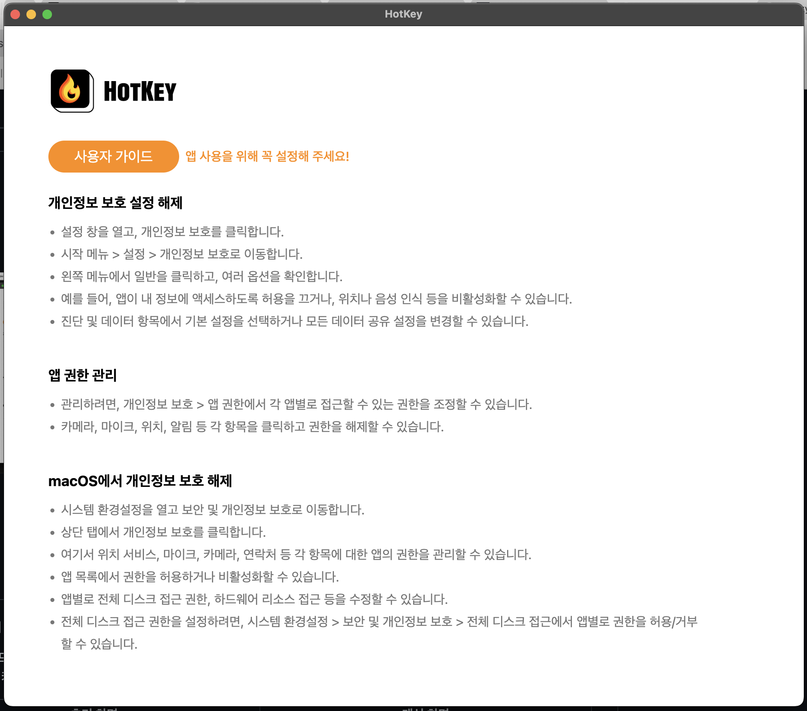 | 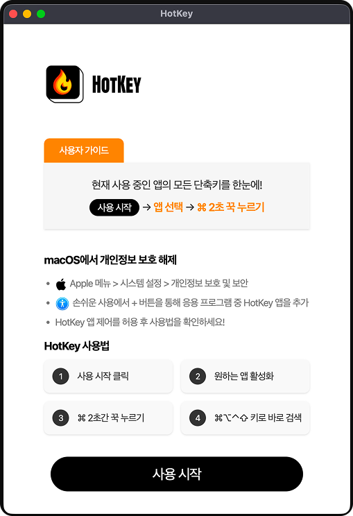 |

#### 3. **단축키 안내 UI**

사용자가 키보드 단축키를 보다 직관적이고 빠르게 정보를 전달해 주기 위해 사용자의 경험치를 향상시키는 방법이
어떤 부분이 있을지 고려하여 가상 키보드 뷰어를 제공하여 자신이 입력한 내용을 즉시 인지할 수 있도록 개선하였습니다.

| **초기 화면**                                                                         | **개선 화면**                                                                        |
| ------------------------------------------------------------------------------------- | ------------------------------------------------------------------------------------ |
| 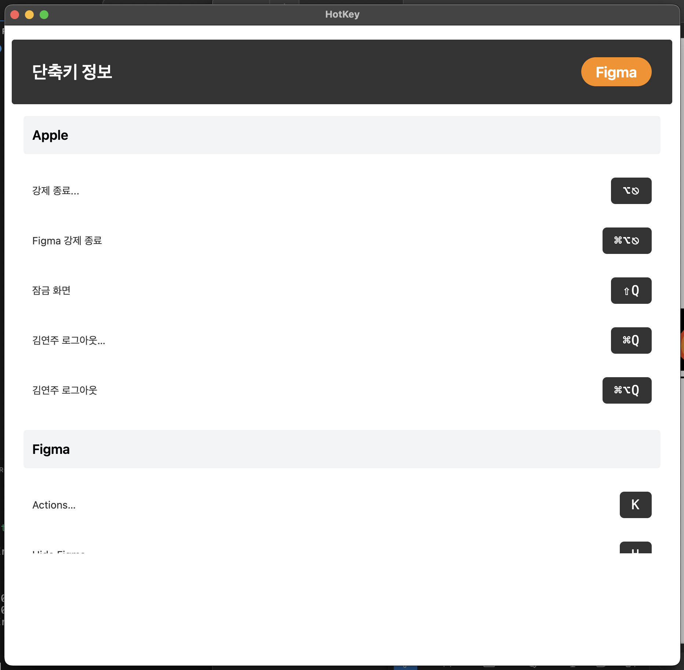 | 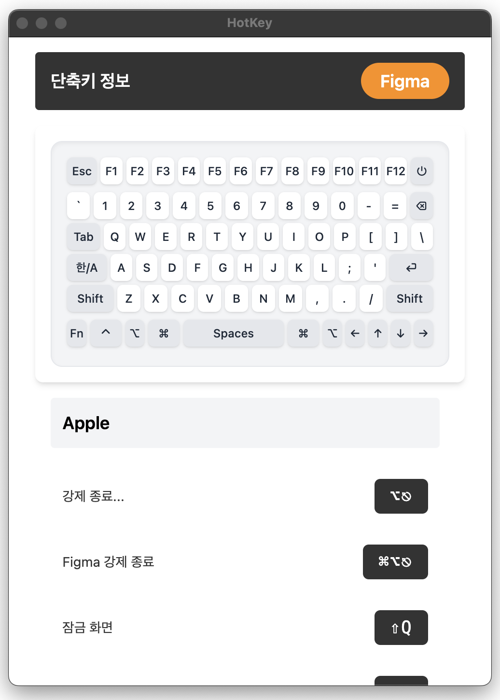 |

#### 4. **Command 롱프레스 활성화 안내 UI**

단축키를 확인하기 위한 직관적인 안내 화면을 제공하여 사용자가 쉽게 앱을 활성화할 수 있도록 개선하였습니다.

| **기능**  | **설명**                                                                                               |
| --------------------------- | ------------------------------------------------------------------------------------------------------ |
| **단계별 사용법 안내**      | 4단계 그리드 형태로 사용법을 시각적으로 안내합니다. (사용 시작 → 앱 활성화 → ⌘ 2초 누르기 → 키로 검색) |
| **원형 프로그레스바**       | Command 키 롱프레스 시 진행률을 SVG 원형 프로그레스바로 실시간 표시합니다.                             |
| **진행률 텍스트 표시**      | 롱프레스 진행 중 "% 진행 중..." 텍스트로 현재 상태를 안내합니다.                                       |
| **대기 상태 표시**          | 앱이 준비 상태일 때 "대기 중..." 애니메이션 뱃지를 표시합니다.                                         |

---

### 전역 키 리스너 및 Command 롱프레스 활성화 기능

#### node-global-key-listener를 활용한 전역 키보드 감지

| **기능**     | **설명**                                                                                                                            |
| ------------------------------ | ----------------------------------------------------------------------------------------------------------------------------------- |
| **리스너 초기화 및 에러 처리** | 기존 리스너가 있으면 `kill()`로 정리 후 새로 생성하며, `try/catch`로 초기화 실패를 안전하게 처리합니다.                             |
| **전역 키보드 이벤트 감지**    | `node-global-key-listener` 라이브러리를 통해 HotKey 앱이 포커스되지 않은 상태에서도 키보드 입력을 감지합니다.                       |
| **Command 키 롱프레스 감지**   | Command(⌘) 키를 2초간 누르면 자동으로 HotKey 앱이 활성화됩니다. 다른 키와 조합되면 롱프레스가 취소되며, 마우스 이벤트는 무시합니다. |
| **IPC 상태 전달**              | `global-key-state` 채널을 통해 Command 키의 눌림/해제 상태를 렌더러 프로세스에 실시간으로 전달합니다.                               |
| **실시간 진행률 표시**         | 50ms 간격으로 롱프레스 진행률을 계산하여 원형 프로그레스바로 표시합니다.                                                            |
| **마우스 커서 기반 창 위치**   | 롱프레스 완료 시 마우스 커서 위치 근처에 HotKey 창이 나타나며, 화면 경계를 벗어나지 않도록 자동 조정됩니다.                         |

```typescript
const LONG_PRESS_DURATION = 2000;

function setupGlobalKeyListener(): void {
  if (globalKeyListener) {
    globalKeyListener.kill();
    globalKeyListener = null;
  }

  try {
    globalKeyListener = new GlobalKeyboardListener();
  } catch {
    return;
  }

  let isCommandPressed = false;
  let otherKeyPressed = false;

  globalKeyListener.addListener((e) => {
    const key = e.name?.toUpperCase();
    const isDown = e.state === "DOWN";

    const isCommandKey =
      key === "LEFT META" ||
      key === "RIGHT META" ||
      key?.includes("META") ||
      key?.includes("CMD") ||
      key?.includes("COMMAND");

    if (isCommandKey) {
      if (isDown) {
        if (!isCommandPressed) {
          isCommandPressed = true;
          otherKeyPressed = false;
          mainWindow?.webContents.send("global-key-state", {
            key: "command",
            pressed: true,
          });
          startLongPress();
        }
      } else {
        isCommandPressed = false;
        mainWindow?.webContents.send("global-key-state", {
          key: "command",
          pressed: false,
        });
        clearLongPressTimer();
      }
      return;
    }

    const isMouseEvent = key?.includes("MOUSE");
    if (isDown && isCommandPressed && !otherKeyPressed && !isMouseEvent) {
      otherKeyPressed = true;
      clearLongPressTimer();
    }
  });
}
```

#### IPC 통신을 통한 렌더러 프로세스 연동

| **채널**               | **설명**                                                    |
| ---------------------- | ----------------------------------------------------------- |
| `global-key-state`     | Command 키의 눌림/해제 상태를 렌더러에 전달                 |
| `global-key-progress`  | 롱프레스 진행률(0-100%)을 실시간으로 렌더러에 전달          |
| `global-key-activated` | 롱프레스 완료 시 활성화 상태와 현재 앱 이름을 렌더러에 전달 |

# 개발 과정에서 부딪쳤던 이슈

### UI 스크랩핑 시간 소요 이슈

| **이슈**     | **상세 설명**                                                                                                                                               |
| ------------------------------ | ----------------------------------------------------------------------------------------------------------------------------------------------------------- |
| **AppleScript 실행 속도 문제** | AppleScript 실행 속도가 원체 느린 상황에서 사용자의 활성화된 앱의 메뉴바의 모든 정보들을 가져오려 하니, **시간 소요는 100초**로 지연이 되는 상황이었습니다. |
| **예시 이미지**                | 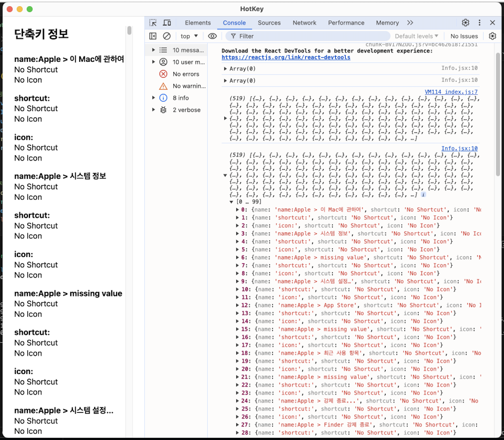                                                                         |

### 해결 방안

| **해결 방법**  | **상세 설명**                                                                                                                                                                                        |
| -------------------------------- | ---------------------------------------------------------------------------------------------------------------------------------------------------------------------------------------------------- |
| **AppleScript 성능 개선**        | 필요한 메뉴 항목만 스크랩하도록 **AppleScript를 최적화**하였습니다. 모든 메뉴 항목을 탐색하기보다, **단축키 정보만 있는 항목만** 가져오도록 하여 **시간 소요는 최대 20초(약 80%)로 개선**되었습니다. |
| **localStorage 캐싱**            | 데이터를 처음 받아올 때 **로컬스토리지에 저장** 후, 이후 사용 시 캐싱된 정보를 제공하여 **시간 소요는 최대 1~2초로 개선**되었습니다.                                                                 |
| **예시 이미지**                  | 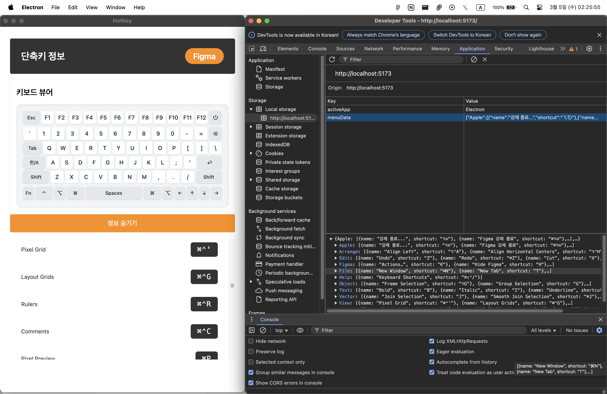                                                                                                                 |

### 단축키 아이콘 실제 UI와 다른 이슈

| **이슈**               | **상세 설명**                                                                                                                             |
| ---------------------------------------- | ----------------------------------------------------------------------------------------------------------------------------------------- |
| **특수기호가 정확히 추출되지 않는 문제** | 단축키 정보는 제대로 가져와지는데, 특수기호가 정확하게 추출되지 않는 상황이 발생했습니다. 예를 들어, `⌥ A`가 `⌥⌃A`로 출력되는 문제입니다. |
| **예시 이미지**                          | 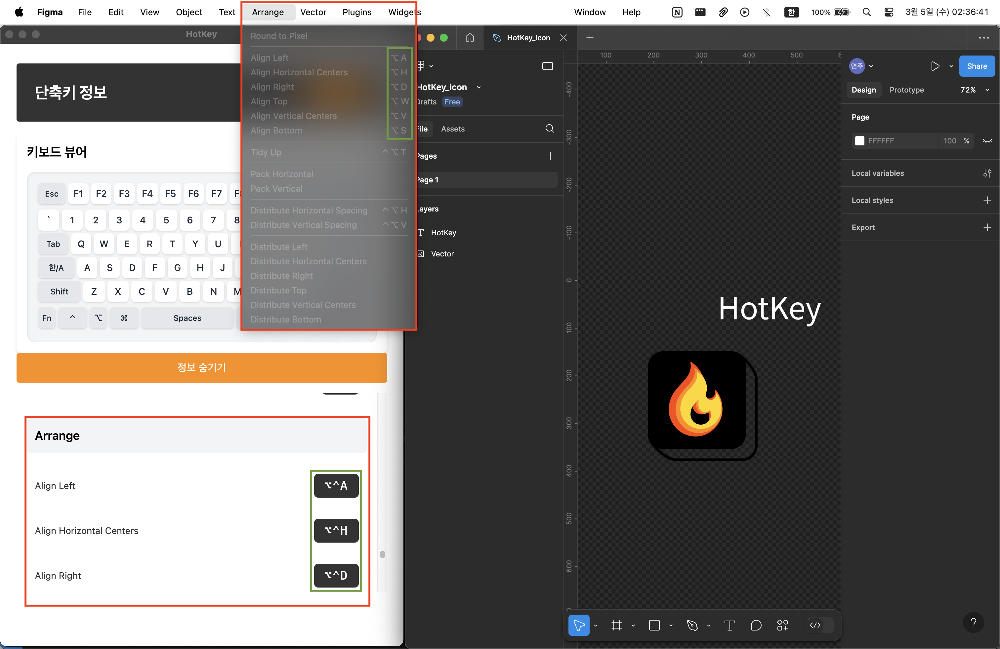                                                          |

### 해결 방안

| **해결 방법**  | **상세 설명**                                                                                                                         |
| -------------------------------- | ------------------------------------------------------------------------------------------------------------------------------------- |
| **시스템 폰트 개선**             | macOS 시스템 폰트("SF Pro")를 전체 body에 적용하여 특수기호가 정확히 표시되도록 개선하였습니다.                                       |
| **예시 이미지**                  | 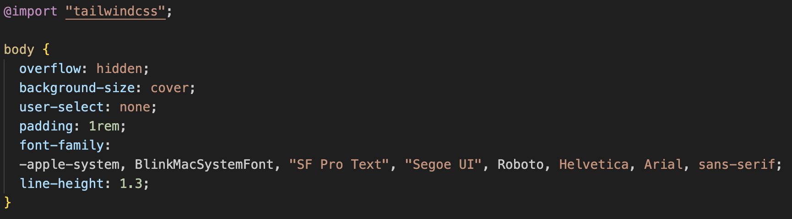                                                        |
| **AppleScript 추출값 검증**      | 스크립트 편집기를 통해 필터링 전 데이터 추출값을 개별 점검하였습니다.                                                                 |
| **예시 이미지**                  | 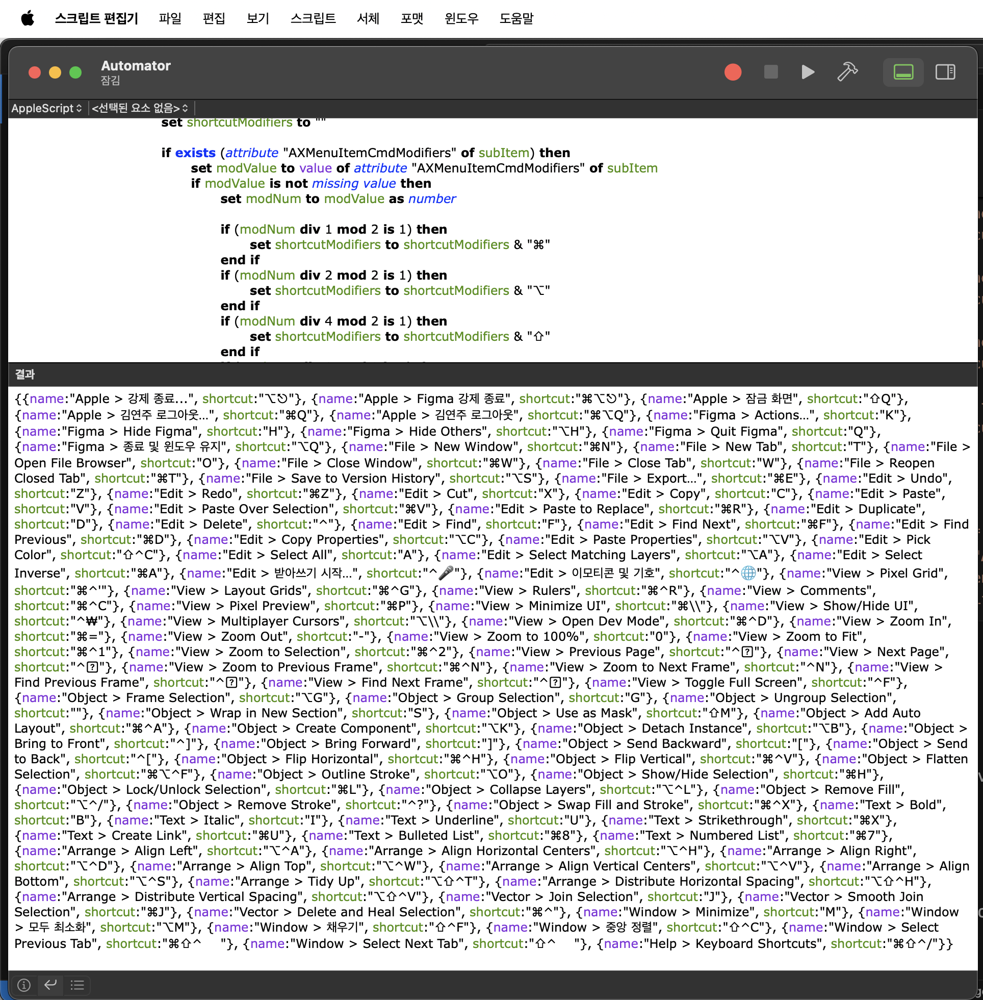                                                        |
| **모디파이어 키 매핑 개선**      | `AXMenuItemCmdModifiers` 비트 연산으로 macOS 표준 순서(⌃→⌥→⇧→⌘)에 맞게 모디파이어를 정확히 매핑하였습니다.                            |
| **특수 키 심볼 변환**            | `AXMenuItemCmdGlyph`(AppleScript)와 `normalizeShortcut`(TypeScript)를 활용하여 Tab, Delete, 방향키 등을 macOS 표준 심볼로 변환합니다. |
| **Function 키 지원**             | `AXMenuItemCmdVirtualKey` 속성으로 Virtual Key Code 기반 F1~F15를 매핑합니다.                                                         |
| **동적 앱 감지**                 | `getActiveApp`으로 활성 앱을 실시간 감지하고, 앱 전환 시 자동으로 단축키 정보를 갱신합니다.                                           |

---

### HotKey앱 다운로드 파일 용량 초과 이슈

| **이슈**  | **상세 설명**                                                                                                                                                                                                                                                                                                                                                                                                             |
| --------------------------- | ------------------------------------------------------------------------------------------------------------------------------------------------------------------------------------------------------------------------------------------------------------------------------------------------------------------------------------------------------------------------------------------------------------------------- |
| **GitHub의 파일 용량 제한** | HotKey 앱 다운로드 페이지를 Netlify에 배포하기 전 정적인 페이지를 만들기 위해 작업을 진행하는 도중 초기에는 파일구조 내에 zip파일을 넣어두고 a태그에서 download하는 방식으로 진행하였습니다. 그러나 GitHub에서는 파일 1개 당 용량이 **50MB을 넘으면 warning, 100MB를 넘으면 error**로 판단합니다. 용량이 100MB를 초과하는 파일을 commit 후 push하게 되면 **error**가 발생하며 zip파일이 push가 안 되는 이슈가 있었습니다. |
| **예시 이미지**             | 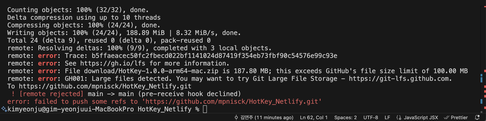                                                                                                                                                                                                                                                                                                                                         |

---

### 해결 방안

| **해결 방법**             | **상세 설명**                                                                                                                                                                        |
| ------------------------------------------- | ------------------------------------------------------------------------------------------------------------------------------------------------------------------------------------ |
| **1차 개선: Homebrew로 Git LFS 설치**       | Git 저장소의 크기와 속도를 최적화하여 **대용량 파일 관리**와 **저장소 용량 문제**, **버전 관리 효율성** 등을 해결할 수 있었습니다.                                                   |
| **예시 이미지**                             | 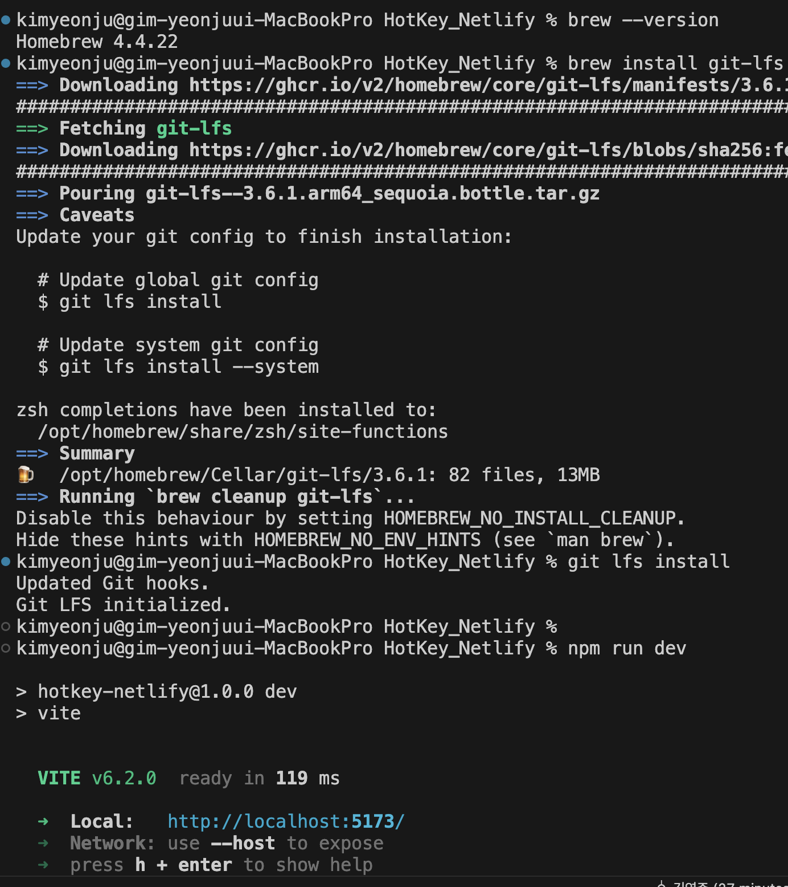                                                                                                   |
| **2차 개선: a태그 내 앱다운로드 링크 첨부** | 깃허브 릴리즈내에 다운로드 링크를 우클릭하여 링크 복사를 한 뒤 a태그 href내에 걸어주었습니다. (https://github.com/mpnisck/HotKey/releases/download/hotkey-v2/HotKey-1.0.0-arm64.dmg) |
| **예시 이미지**                             | 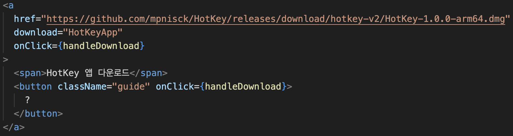                                                                                            |

---

### 빌드 크기 최적화 (DMG 203MB → 96MB)

| **이슈**  | **상세 설명**                                                                                                                                                                                                                                                                        |
| --------------------------- | ------------------------------------------------------------------------------------------------------------------------------------------------------------------------------------------------------------------------------------------------------------------------------------ |
| **DMG 빌드 파일 용량 과다** | 앱을 빌드하여 DMG 파일을 생성했을 때 **203MB**의 큰 용량이 발생하였습니다. 렌더러 전용 패키지(`tailwindcss`, `zustand`, `react-router-dom` 등)가 `dependencies`에 위치하여 Electron 빌드 시 `node_modules`에 포함되고, 불필요한 파일들이 프로덕션 번들에 함께 포함되는 문제였습니다. |

### 해결 방안

| **해결 방법**              | **상세 설명**                                                                                                                                                                                                                                |
| -------------------------------------------- | -------------------------------------------------------------------------------------------------------------------------------------------------------------------------------------------------------------------------------------------- |
| **렌더러 전용 패키지 devDependencies 이동**  | `tailwindcss`, `postcss`, `zustand`, `react-router-dom` 등 빌드 시에만 필요한 패키지를 `dependencies`에서 `devDependencies`로 이동하여 프로덕션 번들에서 제외하였습니다. Electron은 `dependencies`의 패키지만 최종 앱에 포함하기 때문입니다. |
| **electron-builder.yml 파일 제외 패턴 추가** | `dist/`, `node_modules/`, `READMEIMG/`, 각종 설정 파일(`tsconfig`, `eslint`, `tailwind` 등)을 빌드에서 제외하는 패턴을 추가하여 불필요한 파일이 번들에 포함되지 않도록 하였습니다.                                                           |
| **compression: maximum 설정 적용**           | `electron-builder.yml`에 `compression: maximum` 옵션을 추가하여 빌드 결과물의 압축률을 최대로 적용하였습니다.                                                                                                                                |
| **불필요한 macOS 권한 제거**                 | 사용하지 않는 카메라, 마이크, 문서/다운로드 폴더 접근 권한을 제거하고, 실제 필요한 `NSAppleEventsUsageDescription`과 `NSAccessibilityUsageDescription` 권한만 유지하였습니다.                                                                |
| **빌드 설정 통합**                           | `package.json`에 중복 정의되어 있던 `build` 필드를 제거하고 `electron-builder.yml`로 통합하여 설정 충돌을 방지하고 관리를 일원화하였습니다.                                                                                                  |

> **결과**: DMG 파일 크기 **203MB → 96MB** (약 53% 감소)

# 회고록

배움에는 끝이 없다는 것을 느낀 프로젝트였습니다.<br>

주니어 개발자가 되기 위해 첫걸음을 내디디며, 아이디어 구상부터 기획, 디자인, 개발 과정까지,<br>
원하는 결과를 얻기 위해 처음에 구축한 코드들을 모두 뒤엎고 새로운 방식을 시도하면서 겪었던 트러블슈팅과<br>
그 안에서의 끊임없는 회고를 통해 많은 성장을 이룰 수 있었습니다.

Electron 프레임워크를 처음 접하면서 ipc를 통해 데이터가 오가는 흐름을 이해하고,<br>
웹뿐만 아니라 앱의 세계 역시 무궁무진하다는 것을 배웠습니다.<br>
이 과정에서, 앞으로 어떤 서비스를 만들고, 어떤 개발자로 성장할 것인지에 대해 깊이 고민하게 되었습니다.

가장 명확했던 점은, 이 모든 과정들이 저에게 끊임없는 배움의 연속이었다는 것입니다.<br>
스스로 정한 기한 안에 칸반을 해결해 나가며 중심을 잡아야 하는 순간들이 많았습니다.

특히, 완성도 높은 프로젝트를 마무리하려면 명확한 목적성과 방향성이 필요하다고 생각했고,<br>
UI/UX를 구현하며 중요하게 생각한 방향성은 "해당 서비스를 이용하는 사용자의 입장이라면 어떨까?<br>
제3자의 입장으로 생각하는 것"이었습니다.

그렇게 생각하게 된 이유는 저는 "개발"이라는 건 무궁무진한 웹앱의 세계를 사람들에게 더 접근성 좋게 다가가게 해주는 하나의 도구로 보고 있습니다. 그 도구를 어떻게 잘 활용할지는 제 몫이자 역량이라고 생각하며, 앞으로 어떤 서비스를 개발해야 하는지 방향성을 제시해 준 소중한 프로젝트였습니다.
