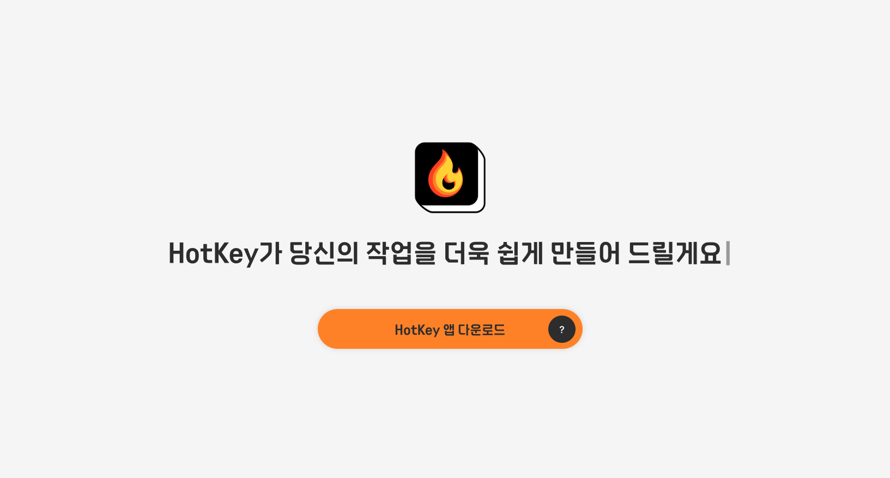

# HotKey

<p align="center"></p>
<p align="center">사용자가 이용하고 있는 프로그램의 단축키 정보를 검색하지말고 바로 알아보자!</p>

# HotKey 앱 다운로드

[](https://hotkey-v2.netlify.app/)

# 목차

1. [개발 배경](#개발-배경)
   - [알아두면 유용한 단축키 정보를 검색하지 않고 바로 알 수는 없을까?](#알아두면-유용한-단축키-정보를-검색하지-않고-바로-알-수는-없을까)
2. [HotKey 기능 미리보기](#HotKey-기능-미리보기)
   - [사용시작 버튼 원클릭으로 메뉴바의 단축키 정보 수집](#사용시작-버튼-원클릭으로-메뉴바의-단축키-정보-수집)
   - [특수기호 입력 시 실시간 단축키 정보 제공](#특수기호-입력-시-실시간-단축키-정보-제공)
   - [필터링된 단축키 정보 안내](#필터링된-단축키-정보-안내)
   - [가상 키보드 기반 단축키 시각화 기능](#가상-키보드-기반-단축키-시각화-기능)
3. [기술 스택 + 선정 이유](#기술-스택-+-선정-이유)
   - [Frontend](#Frontend)
   - [Backend](#Backend)
   - [Development Tools](#Development-Tools)
4. [개발 과정](#개발-과정)
   - [앱 접근성 향상을 위해 개인정보 보호 설정 해제 팝업창 띄우기](#앱-접근성-향상을-위해-개인정보-보호-설정-해제-팝업창-띄우기)
   - [앱 실행 시 ProgressBar 만들기](#앱-실행-시-progressbar-만들기)
   - [사용자의 활성화된 앱 메뉴바 정보 가져오기](#사용자의-활성화된-앱-메뉴바-정보-가져오기)
   - [메뉴바 단축키 정보에 맞는 특수기호 추출하기](#메뉴바-단축키-정보에-맞는-특수기호-추출하기)
   - [메뉴바 최종 단축키 생성](#메뉴바-최종-단축키-생성)
   - [UI 고려사항](#UI-고려사항)
5. [개발 과정에서 부딪쳤던 이슈](#개발-과정에서-부딪쳤던-이슈)
   - [UI 스크랩핑 시간 소요 이슈](#UI-스크랩핑-시간-소요-이슈)
   - [단축키 아이콘 실제 UI와 다른 이슈](#단축키-아이콘-실제-ui와-다른-이슈)
   - [HotKey앱 다운로드 파일 용량 초과 이슈](#HotKey앱-다운로드-파일-용량-초과-이슈)
6. [회고록](#회고록)

# 개발 배경

### **알아두면 유용한 단축키 정보를 검색하지 않고 바로 알 수는 없을까?**

작업속도를 빠르게 향상시키기 위해 단축키를 검색하지 않고 바로 알고 싶었습니다.<br>
과거 퍼블리셔로 일하면서 디자인 작업도 병행한 경험이 있었는데 그 당시에는 보안이 철저한 근무 환경으로<br>
피그마와 같은 외부 라이브러리 프로그램 사용할 수 없어 주로 포토샵과 일러스트레이터를 사용했습니다.

하지만 프론트엔드 부트캠프를 진행하면서 피그마를 접하게 되었고, 포토샵과 상이한 단축키들이 있음을 알게 되어,<br>
작업 중에 단축키를 일일이 검색하는 것이 번거롭다는 점을 느꼈습니다.

이 불편함을 해결하기 위해 단축키 안내 프로그램을 직접 개발하면<br>
훨씬 더 효율적으로 작업할 수 있을 것 같아 해당 프로젝트를 시작하게 되었습니다.

# HotKey 기능 미리보기

### 사용시작 버튼 원클릭으로 메뉴바의 단축키 정보 수집

앱이 실행되었다는 로딩 애니메이션이 끝나면 가이드 안내 페이지가 나타나고<br>
개인정보 보호 해제를 위해 사용자 시스템설정을 자동으로 실행 시켜주어 안내 화면에 맞춰 허용해주고<br>
`사용시작` 버튼을 클릭 후 작업하고 있던 앱을 실행시키면 활성화된 메뉴바에 있는 단축키 정보를 수집합니다.


### 특수기호 입력 시 실시간 단축키 정보 제공

`⌘ 1`을 누르는 순간 작업을 진행하는 해당 화면에서 단축키 정보가 필터링된 화면으로
HotKey 앱 화면이 열리고 다시 `⌘ 1` 누르면 앱이 닫아집니다.


### 필터링된 단축키 정보 안내

데이터를 불러오는 동안 로딩 애니메이션이 나타나고 실행했던 앱의 단축키 정보가 보여진 후,
사용자가 특수기호를 입력했을 때 필터링된 단축키가 나타납니다.


### 가상 키보드 기반 단축키 시각화 기능

사용자의 키보드 액션을 감지하여 키보드뷰어내에 사용자가 어떤 키보드를 눌렀는지
직관적인 UI를 통해 사용자가 키 입력을 인식하기 쉽게 만들어줍니다.


# 기술 스택 + 선정 이유

### Frontend


- **컴포넌트 기반 구조**<br>
  UI를 작은 컴포넌트로 나누어 관리하고, 재사용하며 유지보수와 확장성 측면에 유리합니다.

- **빠르고 동적인 UI**<br>
  React의 상태 관리와 프로젝트 기능 중 키보드 액션을 가상키보드내에 동적인 UI를 제공하기 위해서 사용하기에 적합하다고 판단하였습니다.

- **호환성**<br>
  React는 다양한 라이브러리, 도구, 플러그인과 호환되므로 Tailwind, GitHub Release 등과 쉽게 통합 가능하다고 판단하였습니다.


- **웹 기술을 사용한 데스크탑 앱 개발**<br>
  HTML, CSS, JavaScript을 통해 웹 개발을 진행한 적이 있어 3주의 단기 프로젝트 기간동안 적용하기에 적합하다고 판단하였습니다.

- **강력한 Node.js 통합**<br>
  일렉트론은 Node.js와 통합되어 있어 파일 시스템 접근, 데이터베이스 연결, 네트워크 요청 처리 등 다양한 서버 측 작업을 하기에 수월하다고 판단하였습니다.


- **유틸리티 퍼스트 접근법**<br>
  유틸리티 클래스를 제공하여 CSS 파일을 따로 작성하지 않고 HTML 코드에서 직접 스타일을 적용하여 필요한 스타일을 빠르고 유연하게 대응할 수 있다는 점이 매력적으로 느껴져 선정하게 되었습니다.


- **macOS 시스템 환경 제어 가능**<br>
  Electron 애플리케이션 내에서 AppleScript를 사용하면 macOS에서만 제공하는 시스템 환경을 제어할 수 있기에
  사용자의 시스템 앱의 메뉴바에 접근하기에 적합하다고 판단하였습니다.

- **비동기 작업 처리**<br>
  Electron 환경에서는 child_process 모듈을 사용하여 비동기적으로 AppleScript를 실행할 수 있습니다.
  이로 인해 애플리케이션의 UI가 멈추지 않고 원활하게 실행됩니다.

---

### Backend


- **번들링 시간 단축**<br>
  기존 Electron은 Webpack을 사용하여 번들링을 했기 때문에 시간이 길었기에 애플리케이션 개발 시 번들링 시간을 크게 단축시킬 수 있습니다.

- **빠른 UI 실행 속도**<br>
  React와 Tailwind CSS를 사용하여 UI를 개발할 때,
  Vite의 빠른 속도 덕분에 수월하게 실행할 수 있습니다.

- **핫 모듈 리로드(HMR)**<br>
  Vite의 HMR(핫 모듈 리로드) 기능 덕분에 코드의 변경 사항이 즉시 반영됩니다.
  이는 빠르게 프로토타입을 만들고 테스트할 수 있게 하며, 프로젝트를 개선하는 데 유리합니다.


- **설정 없이 바로 사용 가능**<br>
  Zustand는 복잡한 설정 없이 바로 사용할 수 있습니다.
  Redux와 같은 상태 관리 라이브러리에서는 액션, 리듀서, 스토어 등을 설정하지만
  반면에 Zustand는 이러한 설정이 필요 없어서 상태 관리가 매우 간단하고 직관적입니다.

- **자동 리렌더링 최적화**<br>
  상태를 업데이트할 때 변경된 부분만 리렌더링하도록 최적화됩니다.
  이로 인해 불필요한 리렌더링을 방지하고 애플리케이션 성능을 최적화할 수 있습니다.

---

### Development Tools


- **자동화된 코드 포매팅**<br>
  수동으로 코드 스타일을 맞추지 않아도 되므로 코드 스타일에
  신경 쓸 필요가 없어 일관된 코드 스타일을 위해 선정하였습니다.

- **생산성 향상**<br>
  자동화된 도구가 포매팅을 대신 처리하므로, 기능 구현에 더 많은 시간을 할애할 수 있습니다.


- **버그 예방**<br>
  코드에서 발생할 수 있는 잠재적인 버그를 사전에 찾아주는 장점이 있습니다.


- **패키지 관리의 효율성**<br>
  Homebrew를 사용하면 필요한 도구나 라이브러리를 간단히 설치하여 효율성이 높다고 판단하였습니다.

# 개발 과정

### 앱 접근성 향상을 위해 개인정보 보호 설정 해제 팝업창 띄우기

#### 1. shell.openExternal + app.whenReady 사용

| **shell.openExternal**                                                                                                                                                                                    | **app.whenReady()**                                                                                                                                                                |
| --------------------------------------------------------------------------------------------------------------------------------------------------------------------------------------------------------- | ---------------------------------------------------------------------------------------------------------------------------------------------------------------------------------- |
| shell 모듈의 openExternal 메서드는 외부 링크를 열 때 사용됩니다.                                                                                                                                          | Electron 애플리케이션이 준비가 완료되었을 때 호출되는 프로미스를 반환하며, 이는 애플리케이션의 초기화가 끝나고, 이벤트 루프가 시작된 상태에서 특정 작업을 수행할 수 있게 해줍니다. |
| x-apple.systempreferences는 시스템 환경설정 앱을 실행하는 특정 URL 스킴이고, com.apple.preference.security는 보안 설정의 항목을 지정하여 Privacy 파라미터는 개인 정보 보호 섹션으로 바로 이동하게 합니다. | 애플리케이션이 whenReady()를 통해 준비된 후에만 창을 생성하게끔 구현되어있습니다.                                                                                                  |

```jsx
const openSecuritySet = () => {
  shell.openExternal(
    "x-apple.systempreferences:com.apple.preference.security?Privacy"
  );
};

app.whenReady().then(() => {
  openSecuritySet();
});
```

### 앱 실행 시 ProgressBar 만들기

#### 1. **React Hook 사용 (useState, useRef, useEffect)**

| useState                                                                                                                  | useRef                                                                                                                                                                                                                                | useEffect                                                                                                                                                                               |
| ------------------------------------------------------------------------------------------------------------------------- | ------------------------------------------------------------------------------------------------------------------------------------------------------------------------------------------------------------------------------------- | --------------------------------------------------------------------------------------------------------------------------------------------------------------------------------------- |
| 프로그레스 바의 진행 상황이 실시간으로 반영되어 UI가 자연스럽게 보여지게끔 로딩 진행 상태를 관리하기 위해 사용하였습니다. | useRef는 UI가 자동으로 업데이트되지 않습니다. 그 이유는 상태를 관리하는 것이 아니라 컴포넌트 리렌더링을 유발하지 않으면서 값만 추적할 때 사용되기에 `animationFrameId`를 추적하여, `requestAnimationFrame`을 취소할 수 있도록 합니다. | 컴포넌트가 처음 렌더링될 때 실행되는 사이드 이펙트를 관리하는 훅이며, 로딩 애니메이션이 시작하고 애니메이션이 끝나면 `navigate("/main")`을 호출하여 페이지를 이동시키도록 해두었습니다. |

#### 2. **로딩 애니메이션 구현**

| requestAnimationFrame                                                                                                                                                                                | performance.now                                                                                                                                                 | Math.min                                                                                                                                                                    |
| ---------------------------------------------------------------------------------------------------------------------------------------------------------------------------------------------------- | --------------------------------------------------------------------------------------------------------------------------------------------------------------- | --------------------------------------------------------------------------------------------------------------------------------------------------------------------------- |
| 브라우저에서 애니메이션을 최적화하여 실행할 수 있도록 해주는 함수로 화면을 부드럽게 갱신하기 위해서 애니메이션을 호출할 때마다 화면이 깜박이지 않도록 최적화된 방식으로 애니메이션을 구현하였습니다. | 현재 시간을 밀리초 단위로 높은 정밀도로 반환하는 함수로 `Date.now()` 와 비슷하지만, 로딩 진행 상태를 계산할 때 정확한 경과 시간을 추적하기 위해 사용하였습니다. | 주어진 여러 숫자 중 가장 작은 값을 반환하는 함수로 진행률이 100이라면 해당 수를 초과하지 않도록 최대값 제한을 설정하여 로딩 애니메이션의 정확한 종료 시점을 확인하였습니다. |

---

### 사용자의 활성화된 앱 메뉴바 정보 가져오기

| **AppleScript 사용 (osascript)**                                                                                                                                 | **JavaScript의 `exec` 함수 사용**                                                                                                                                                                                                                                 |
| ---------------------------------------------------------------------------------------------------------------------------------------------------------------- | ----------------------------------------------------------------------------------------------------------------------------------------------------------------------------------------------------------------------------------------------------------------- |
| **AppleScript**는 문자열 기반의 스크립트 언어로 외부 프로그램과 상호작용할 때 문자열을 전달하고 실행할 명령이나 데이터를 문자열 형식으로 표현해야 합니다.        | `exec` 함수는 외부 명령어를 실행하고, 해당 명령어의 표준 출력(stdout)과 표준 에러(stderr)를 반환받을 수 있게 해주는 함수입니다. 실행이 끝나면 콜백 함수가 호출되어 결과를 처리합니다.                                                                             |
| AppleScript 자체로는 macOS 상단 메뉴바의 모든 정보나 아이콘을 추출할 수 없고, **System Event** 애플리케이션을 사용하여 메뉴바 항목을 탐색하고 정보를 가져옵니다. | `exec` 함수를 사용하여 osaScript를 실행하고,<br> `parseMenuItems` 함수를 사용하여 JSON 형식으로 파싱하였습니다.                                                                                                                                                   |
| 메뉴 항목을 저장할 빈 배열을 생성하고, `menu bar items`를 통해 메뉴 항목들을 가져옵니다.                                                                         | `osascript`는 터미널을 통해 AppleScript를 실행하고 결과를 받을 수 있는 명령어 라인 도구로 `"`가 문자열의 끝을 의미하고 스크립트 내부에서 `"`를 포함하면 전체 문자열이 잘못 해석될 수 있기 때문에 정확하게 전달될 수 있도록 이스케이프 처리를 통해 출력시켰습니다. |
| `repeat with subItem in subMenuItems` 반복문을 사용하여 서브 메뉴 항목들을 처리하며, 에러 발생 시 `try...on error` 블록을 사용하여 에러 메시지를 처리합니다.     | 파싱된 메뉴 항목은 `resolve(menuItems)`를 통해 반환되며,<br>실패할 경우 `try-catch` 문`reject`를 호출하여 에러 처리 핸들링을 하였습니다.                                                                                                                          |

```jsx
const appleScript = `
tell application "System Events"
    tell process "Figma"
        set menuItems to {}
        set menuBarItems to menu bar items of menu bar 1
        repeat with menuItem in menuBarItems
            set menuItemName to name of menuItem
            set subMenuItems to menu items of menu 1 of menuItem
            repeat with subItem in subMenuItems
                set subItemName to name of subItem
                set subItemShortcut to ""
                ...
            end repeat
        end repeat
        return menuItems
    end tell
end tell
`;

exec(
  `osascript -e "${appleScript.replace(/"/g, '\\"')}"`,
  (error, stdout, stderr) => {
    if (error || stderr) {
      reject(new Error(error || stderr));
      return;
    }

    try {
      const menuItems = parseMenuItems(stdout);
      resolve(menuItems);
    } catch (parseError) {
      reject(new Error(`메뉴 항목 파싱 중 오류 발생: ${parseError.message}`));
    }
  }
);
```

---

### 메뉴바 단축키 정보에 맞는 특수기호 추출하기

#### 1. **단축키가 있을 경우 `AXMenuItemCmdModifiers` 속성 사용**

| **내용**                    | **설명**                                                                                              |
| --------------------------- | ----------------------------------------------------------------------------------------------------- |
| **단축키가 있을 경우 처리** | 단축키가 이미 존재하는지 확인하여,<br> 존재하면 `AXMenuItemCmdKey` 속성으로부터 해당 값을 가져옵니다. |
| **단축키 값 할당**          | 단축키가 존재하는 경우, 그 값을 `subItemShortcut` 변수에 할당합니다.                                  |

---

#### 2. **단축키가 없을 경우 `Modifier` 키 처리**

| **내용**                              | **설명**                                                                                                                                                               |
| ------------------------------------- | ---------------------------------------------------------------------------------------------------------------------------------------------------------------------- |
| **Modifier 키란?**                    | Modifier 키는 다른 키와 함께 눌러서 특정 기능을 활성화하는 키로,<br> 일반적으로 `Shift`, `Control (Ctrl)`, `Option (Alt)`, `Command` 키가 포함됩니다.                  |
| **`AXMenuItemCmdModifiers`<br> 속성** | `AXMenuItemCmdModifiers`는 메뉴 항목의 <br> **modifier 키**(`⌘`, `⌥`, `⇧`, `⌃`)를 나타내는 속성입니다.<br> `modValue`는 2진수로 각 비트가 modifier 키를 나타냅니다.    |
| **`modNum`값 확인**                   | `modNum div 1 mod 2 is 1`부터 <br>`modNum div 8 mod 2 is 1`까지의 조건을 통해 modifier 키를 결정합니다.                                                                |
| **각 modifier 키 비트**               | `modNum div 1 mod 2 is 1: ⌘ (Command)` <br> `modNum div 8 mod 2 is 1: ⌃ (Control)` <br> `modNum div 4 mod 2 is 1: ⇧ (Shift)`<br> `modNum div 2 mod 2 is 1: ⌥ (Option)` |
| **modifier 키 처리**                  | 각 modifier 키가 1일 때 해당 키를 `shortcutModifiers`라는 빈 문자열에 추가합니다.                                                                                      |

---

### 메뉴바 최종 단축키 생성

#### 1. **`AXMenuItemCmdKey` 속성 사용**

| **내용**                             | **설명**                                                                                                                                  |
| ------------------------------------ | ----------------------------------------------------------------------------------------------------------------------------------------- |
| **`AXMenuItemCmdKey`<br> 속성 사용** | AppleScript에서 `AXMenuItemCmdKey`는 메뉴 항목에 지정된 단축키의 문자를 반환합니다. 예를 들어, "C"나 "T"와 같은 키 값이 있을 수 있습니다. |
| **단축키 문자 추출 및 처리**         | `AXMenuItemCmdChar` 속성이 존재하면 그 값을 `commandChar`에 저장하고,<br> `shortcutModifiers`와 결합하여 최종 단축키를 생성합니다.        |
| **최종 단축키 생성 예시**            | 예를 들어, `commandChar`가 "C"이고 `shortcutModifiers`가 "⌘"일 경우,<br> 최종 단축키는 `⌘C`와 같이 만들어집니다.                          |

```jsx
  if exists (attribute "AXMenuItemCmdChar" of subItem) then
      set commandChar to value of attribute "AXMenuItemCmdChar" of subItem
      if commandChar is not missing value then
          set subItemShortcut to shortcutModifiers & commandChar
      end if
  end if
```

### UI 고려사항

#### 1. **로딩 화면 UI**

작업환경영역에 침범하여 화면을 번갈아보기에 불편함을 예상하여 특수기호 입력 시
커닝페이퍼처럼 안내해 주는 액션을 통해 디스플레이내에 큰 비율을 차지하지 않도록 수정하였으며,
시작 전 Loading이란 워딩이 사용자에게 거부감을 들 수 있게 할 것 같아 전체 안내 문구 `~해요체` 로 안내 메세지 변경하였습니다.

| **초기 화면**                                                   | **개선 화면**                                                   |
| --------------------------------------------------------------- | --------------------------------------------------------------- |
|  |  |

#### 2. **개인보호 설정 안내 화면 UI**

macOS는 개인정보 보호와 보안을 매우 중요시 여기기 때문에 시스템 자원에 접근하기위해선
사용자에게 개인정보 보호 설정에서 권한을 부여받아야 애플리케이션이 접근이 가능합니다.
초기 안내 설정화면 개선과 개인정보 설정 창을 자동으로 실행시키게끔 해 주었습니다.

| **초기 화면**                                                | **개선 화면**                                                |
| ------------------------------------------------------------ | ------------------------------------------------------------ |
|  |  |

#### 3. **단축키 안내 UI**

사용자가 키보드 단축키를 보다 직관적이고 빠르게 정보를 전달해 주기 위해 사용자의 경험치를 향상시키는 방법이
어떤 부분이 있을지 고려하여 가상 키보드 뷰어를 제공하여 자신이 입력한 내용을 즉시 인지할 수 있도록 개선하였습니다.

| **초기 화면**                                                    | **개선 화면**                                                    |
| ---------------------------------------------------------------- | ---------------------------------------------------------------- |
|  |  |

# 개발 과정에서 부딪쳤던 이슈

### UI 스크랩핑 시간 소요 이슈

| **이슈**                           | **상세 설명**                                                                                                                                               |
| ---------------------------------- | ----------------------------------------------------------------------------------------------------------------------------------------------------------- |
| **AppleScript<br> 실행 속도 문제** | AppleScript 실행 속도가 원체 느린 상황에서 사용자의 활성화된 앱의 메뉴바의 모든 정보들을 가져오려 하니, **시간 소요는 100초**로 지연이 되는 상황이었습니다. |
| **예시 이미지**                    |                                                                                              |

### 해결 방안

| **해결 방법**             | **상세 설명**                                                                                                                                                                                                                    |
| ------------------------- | -------------------------------------------------------------------------------------------------------------------------------------------------------------------------------------------------------------------------------- |
| **AppleScript 성능 개선** | 필요한 메뉴 항목만 스크랩하도록 **AppleScript를 최적화**하였습니다. <br> 예를 들어, 모든 메뉴 항목을 탐색하기보다, **단축키 정보만 있는 항목만** 정보를 가져오도록 하여,<br> **시간 소요는 최대 20초(약 80%)로 개선**되었습니다. |
| **localStorage 캐싱**     | 데이터를 처음 받아올 때 **로컬스토리지에 저장** 후, <br> 이후 사용 시 캐싱된 정보를 제공하여 **시간 소요는 최대 1~2초로 개선**되었습니다.                                                                                        |
| **예시 이미지**           |                                                                                                                                                                   |

### 단축키 아이콘 실제 UI와 다른 이슈

| **이슈**                                     | **상세 설명**                                                                                                                             |
| -------------------------------------------- | ----------------------------------------------------------------------------------------------------------------------------------------- |
| **특수기호가<br> 정확히 추출되지 않는 문제** | 단축키 정보는 제대로 가져와지는데, 특수기호가 정확하게 추출되지 않는 상황이 발생했습니다. 예를 들어, `⌥ A`가 `⌥⌃A`로 출력되는 문제입니다. |
| **예시 이미지**                              |                                                                                 |

### 해결 방안

| **해결 방법**                                                 | **상세 설명**                                                                                                                                                                                                                                                                             |
| ------------------------------------------------------------- | ----------------------------------------------------------------------------------------------------------------------------------------------------------------------------------------------------------------------------------------------------------------------------------------- |
| **시스템 폰트 개선**                                          | macOS는 특수기호를 원활하게 표시하기 위해 **시스템 폰트**를 사용합니다.<br> 예를 들어, "SF Pro"와 같은 폰트는 특수기호를 포함하기 때문에, 이를 전체 **body**에 적용하였습니다.                                                                                                            |
| **예시 이미지**                                               |                                                                                                                                                                                                                               |
| **AppleScript만 별도 스크립트 편집기(Automator) 추출값 확인** | 필터링되기 전 데이터 추출값이 잘 불러와지고 있는지<br> 하나씩 확인하여 초기 데이터부터 점검하였습니다.                                                                                                                                                                                    |
| **예시 이미지**                                               |                                                                                                                                                                                                                               |
| **UI 요소의 속성 사용하여<br> 모디파이어 기호 매핑 개선**     | 표준 macOS UI 순서(⌘ → ⌥ → ⇧ → ⌃)와 `AXMenuItemCmdModifiers`를 사용하여 모디파이어 키의 상태를 나타내며 숫자로 표현하였습니다. <br> `⌘` (Command)는 `1`, <br> `⌥` (Option)는 `2`, <br> `⇧` (Shift)는 `4`, <br> `⌃` (Control)는 `8`으로 설정하였습니다.                                    |
| **단축키 문자 추출 및 결합**                                  | `AXMenuItemCmdChar`에서 반환된 실제 키보드의 문자(예: `B`, `S`, `C`)를 사용하여 단축키의 마지막 부분을 구성하고, 최종적으로 **모디파이어 키**와 **문자**를 결합하여 단축키를 만들어 `subItemShortcut`에 담았습니다. <br> 예시: <br> **⌘B**: Command + B, <br> **⌥⇧D**: Option + Shift + D |
| **컨트롤(⌃) 키 제거**                                         | UI 표시에 적합하지 않거나 필요 없는 경우, `⌃`(Control) 키를 제거합니다.                                                                                                                                                                                                                   |
| **공백을 Command(⌘) 키로 대체**                               | 단축키에 포함된 공백을 `⌘`(Command) 키로 변경하여,<br> 특정 UI 표현 방식에 맞게 처리했습니다.                                                                                                                                                                                             |
| **단일 알파벳 문자에 자동으로 Command(⌘) 추가**               | 단축키가 하나의 알파벳 문자로만 이루어진 경우,<br> 일반적인 단축키 표기 규칙을 따르기 위해 자동으로 `⌘`(Command) 키를 추가합니다.                                                                                                                                                         |

### HotKey앱 다운로드 파일 용량 초과 이슈

| **이슈**                    | **상세 설명**                                                                                                                                                                                                                                                                                                                                                                                                                              |
| --------------------------- | ------------------------------------------------------------------------------------------------------------------------------------------------------------------------------------------------------------------------------------------------------------------------------------------------------------------------------------------------------------------------------------------------------------------------------------------ |
| **GitHub의 파일 용량 제한** | HotKey 앱 다운로드 페이지를 Netlify에 배포하기 전 정적인 페이지를 만들기 위해 작업을 진행하는 도중 초기에는 파일구조 내에 zip파일을 넣어두고 a태그에서 download하는 방식으로 진행하였습니다.<br> 그러나 GitHub에서는 파일 1개 당 용량이 **50MB을 넘으면 warning,<br> 100MB를 넘으면 error**로 판단합니다. <br> 용량이 100MB를 초과하는 파일을 commit 후 push하게 되면<br> **error**가 발생하며 zip파일이 push가 안 되는 이슈가 있었습니다. |
| **예시 이미지**             |                                                                                                                                                                                                                                                                                                                                                                              |

---

### 해결 방안

| **해결 방법**                                            | **상세 설명**                                                                                                                                                                        |
| -------------------------------------------------------- | ------------------------------------------------------------------------------------------------------------------------------------------------------------------------------------ |
| **`1차 개선`<br> Homebrew<br>사용하여<br> Git LFS 설치** | Git 저장소의 크기와 속도를 최적화하여<br> **대용량 파일 관리**와 **저장소 용량 문제**, **버전 관리 효율성** 등을 해결할 수 있었습니다.                                               |
| **예시 이미지**                                          |                                                                                                                       |
| **`2차 개선`<br> a태그 내에<br> 앱다운로드 링크 첨부**   | 깃허브 릴리즈내에 다운로드 링크를 우클릭하여 링크 복사를 한 뒤 a태그 href내에 걸어주었습니다. (https://github.com/mpnisck/HotKey/releases/download/hotkey-v2/HotKey-1.0.0-arm64.dmg) |
| **예시 이미지**                                          |                                                                                                                       |

# 회고록

배움에는 끝이 없다는 것을 느낀 프로젝트였습니다.<br>

주니어 개발자가 되기 위해 첫걸음을 내디디며, 아이디어 구상부터 기획, 디자인, 개발 과정까지,<br>
원하는 결과를 얻기 위해 처음에 구축한 코드들을 모두 뒤엎고 새로운 방식을 시도하면서 겪었던 트러블슈팅과<br>
그 안에서의 끊임없는 회고를 통해 많은 성장을 이룰 수 있었습니다.

Electron 프레임워크를 처음 접하면서 ipc를 통해 데이터가 오가는 흐름을 이해하고,<br>
웹뿐만 아니라 앱의 세계 역시 무궁무진하다는 것을 배웠습니다.<br>
이 과정에서, 앞으로 어떤 서비스를 만들고, 어떤 개발자로 성장할 것인지에 대해 깊이 고민하게 되었습니다.

가장 명확했던 점은, 이 모든 과정들이 저에게 끊임없는 배움의 연속이었다는 것입니다.<br>
스스로 정한 기한 안에 칸반을 해결해 나가며 중심을 잡아야 하는 순간들이 많았습니다.

특히, 완성도 높은 프로젝트를 마무리하려면 명확한 목적성과 방향성이 필요하다고 생각했고,<br>
UI/UX를 구현하며 중요하게 생각한 방향성은 "해당 서비스를 이용하는 사용자의 입장이라면 어떨까?<br>
제3자의 입장으로 생각하는 것"이었습니다.

그렇게 생각하게 된 이유는 저는 "개발"이라는 건 무궁무진한 웹앱의 세계를 사람들에게 더 접근성 좋게 다가가게 해주는 하나의 도구로 보고 있습니다. 그 도구를 어떻게 잘 활용할지는 제 몫이자 역량이라고 생각하며, 앞으로 어떤 서비스를 개발해야 하는지 방향성을 제시해 준 소중한 프로젝트였습니다.
