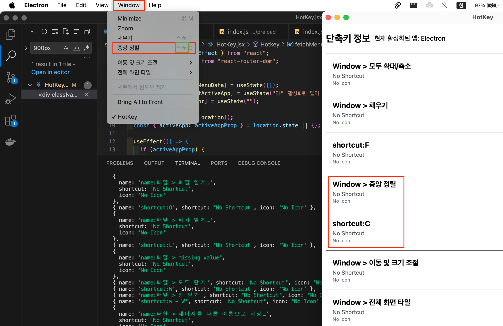

# README


# HotKey

사용자가 이용하고 있는 프로그램의 단축키 정보를 검색하지말고 바로 알아보자!

<aside>

## HotKey 앱 다운로드

- https://hotkey-v1.netlify.app/

## 목차

1. [개발 배경](#개발-배경)
   - [사용자가 알아두면 유용한 단축키 정보를 검색하지 않고 바로 알 수는 없을까?](#사용자가-알아두면-유용한-단축키-정보를-검색하지-않고-바로-알-수는-없을까)
   - [배경요소](#배경요소)
   - [사용자에게 느껴지게끔 하고 싶었던 3가지](#사용자에게-느껴지게끔-하고-싶었던-3가지)
2. [기술 스택 + 선정 이유](#기술-스택--선정-이유)
   - [Frontend](#frontend)
   - [Backend](#backend)
   - [Development Tools](#development-tools)
3. [기능](#기능)
   - [사용자 버튼 클릭으로 메뉴바의 단축키 정보 수집](#사용자-버튼-클릭으로-메뉴바의-단축키-정보-수집)
   - [필터링된 단축키 정보 안내](#필터링된-단축키-정보-안내)
   - [가상키보드를 통한 키보드 액션](#가상키보드를-통한-키보드-액션)
4. [시연 영상](#시연-영상)
5. [개발 과정](#개발-과정)
   - [UI 고려사항](#ui-고려사항)
   - [Electron 애플리케이션의 기본 구조 파악](#electron-애플리케이션의-기본-구조-파악)
   - [앱 초기 실행 시 ProgressBar 만들기](#앱-초기-실행-시-progressbar-만들기)
   - [사용자 활성화된 앱 메뉴바 정보 가져오기](#사용자-활성화된-앱-메뉴바-정보-가져오기)
   - [메뉴바 단축키 정보에 맞는 특수기호 추출하기](#메뉴바-단축키-정보에-맞는-특수기호-추출하기)
   - [메뉴바 단축키 문자 처리](#메뉴바-단축키-문자-처리)
6. [트러블 슈팅](#트러블-슈팅)
   - [UI 스크래핑 시간 소요 이슈](#ui-스크래핑-시간-소요-이슈)
   - [단축키 아이콘 누락 이슈](#단축키-아이콘-누락-이슈)
   - [Electron 배포 이슈](#electron-배포-이슈)
7. [회고록](#회고록)

</aside>

<aside>

## 개발 배경

</aside>

### **사용자가 알아두면 유용한 단축키 정보를 검색하지 않고 바로 알 수는 없을까?**

사용자가 작업을 진행하면서 유용한 단축키 정보나 잊고 있었던 단축키를 쉽게 확인할 수 있도록,
하나의 앱을 실행함으로써 시간 절약과 편의성을 제공하기 위해 개발을 진행하였습니다.

### **+ 배경요소**

과거 퍼블리셔로 일하면서 디자인 작업도 병행한 경험이 있습니다. 그 당시에는 주로 포토샵과 일러스트레이터를 사용했으며, 보안이 철저한 근무 환경 때문에 외부 라이브러리 프로그램을 사용할 수 없어 피그마를 다룰 기회가 많지 않았습니다. 하지만 부트캠프를 진행하면서 피그마를 접하게 되었고, 포토샵과 상이한 단축키들이 있음을 알게 되어, 작업 중에 단축키를 일일이 검색하는 것이 번거롭다는 점을 느꼈습니다. 이 문제를 해결하기 위해 단축키 관리 프로그램을 직접 개발하면 훨씬 더 효율적으로 작업할 수 있을 것 같아 해당 프로젝트를 시작하게 되었습니다.

### **사용자에게 느껴지게끔 하고 싶었던 3가지**

1. 유용하다.
2. 시간 절약했다.
3. 웹이 아닌 데스크톱 앱이다보니 다운로드 받고 사용하는데 거부감이 들지 않는다.

<aside>

## **기술 스택 + 선정 이유**

</aside>

### Frontend

- **React**
  [](https://img.shields.io/badge/React--fff?style=for-the-badge&logo=react&logoColor=fff&logoSize=auto&label=react&labelColor=%2361DAFB&color=%2361DAFB)

  - React는 강력한 UI 라이브러리로서 앱의 상태 관리와 동적 UI 업데이트를 쉽게 처리
  - 2순위 기능 중 사용자의 특정 액션을 통해 해당 단축키에 대한 기능 설명을 가상키보드를 동적인 UI로 제공하기 위해서 사용하기에 적합하다고 판단
  - 컴포넌트 기반 구조:
    UI를 작은 컴포넌트로 나누어 관리하고, 재사용하며 유지보수와 확장성 측면에 유리
  - 빠르고 동적인 UI:
    React의 상태 관리와 UI 업데이트 기능을 통해 사용자가 상호작용할 때마다 즉시 반영되는 동적인 UI를 쉽게 제작 가능
  - 호환성:
    React는 다양한 라이브러리, 도구, 플러그인과 호환되므로, Firebase, Tailwind, GitHub Release 등과 쉽게 통합가능

- **Electron (HTML, CSS, JavaScript, Node.js)**
  [](https://img.shields.io/badge/electron--Label?style=for-the-badge&logo=electron&logoColor=fff&logoSize=autoa&label=Electron&labelColor=%2347848F&color=47848F)

  - Electron은 JavaScript와 HTML, CSS를 이용해 데스트톱앱을 제작할 수 있는 프레임워크
  - Chromium과 Node.js를 바이너리에 내장
    _(바이너리_ _Binary는 1과 0만을 사용하여 데이터와 명령을 나타내는 이진수 시스템)_
  - Electron은 하나의 JavaScript 코드로 Windows와 macOS, Linux에서 모두 작동할 수 있는 크로스 플랫폼 App을 만들 수 있도록 도움
  - Main은 백엔드 역할, 창 관리, 시스템 API 호출을 담당.
  - Renderer는 프론트엔드 역할, UI를 렌더링하고 사용자 상호작용을 처리

- **Tailwind CSS**
  [](https://img.shields.io/badge/tailwindcss--fff?style=for-the-badge&logo=tailwindcss&logoColor=fff&logoSize=auto&label=tailwindcss&labelColor=%2306B6D4&color=%2306B6D4)

  - Tailwind CSS는 빠르고 유연한 UI 스타일링
  - 기존에 사용한 적이 있어 러닝커브가 낮아 해당 기술이 적합하다고 판단

- **AppleScript**
  [](https://img.shields.io/badge/AppleScript--fff?style=for-the-badge&logo=path%20d%3D%22M12.152%206.896c-.948%200-2.415-1.078-3.96-1.04-2.04.027-3.91%201.183-4.961%203.014-2.117%203.675-.546%209.103%201.519%2012.09%201.013%201.454%202.208%203.09%203.792%203.039%201.52-.065%202.09-.987%203.935-.987%201.831%200%202.35.987%203.96.948%201.637-.026%202.676-1.48%203.676-2.948%201.156-1.688%201.636-3.325%201.662-3.415-.039-.013-3.182-1.221-3.22-4.857-.026-3.04%202.48-4.494%202.597-4.559-1.429-2.09-3.623-2.324-4.39-2.376-2-.156-3.675%201.09-4.61%201.09zM15.53%203.83c.843-1.012%201.4-2.427%201.245-3.83-1.207.052-2.662.805-3.532%201.818-.78.896-1.454%202.338-1.273%203.714%201.338.104%202.715-.688%203.559-1.701%22&logoColor=fff&logoSize=auto&label=AppleScript&labelColor=%23000000&color=%23000000)

  - Electron 애플리케이션 내에서 AppleScript를 사용하면 macOS에서만 제공하는
    시스템 환경을 제어할 수 있기에 사용자의 시스템 앱의 메뉴바에 접근하기에 적합하다고 판단
  - JavaScript (Electron) → child_process → AppleScript 실행 → 결과 반환 → JavaScript에서 처리
  - Electron환경에서 비동기적으로 작업을 처리하여, macOS에 설치된 다른 애플리케이션들과 쉽게 연동 애플리케이션의 UI가 멈추지 않고 원활하게 실행된다면 메뉴바 정보도 신속히 접근이 가능하다고 판단

### Backend

- **Electron-Vite**
  [](https://img.shields.io/badge/Vite--fff?style=for-the-badge&logo=Vite&logoColor=fff&logoSize=auto&label=Vite&labelColor=646CFF&color=646CFF)

  - 기존 Electron은 Webpack을 사용하여 번들링 시간이 길었음.
  - React와 Tailwind CSS를 사용하여 UI를 개발할 때, Vite의 빠른 속도 덕분에 빠르게 실행
  - HMR(핫 모듈 리로드) 덕분에 변경 사항이 즉시 반영되므로 빠르게 프로토타입을 만들고 개선
    _(프로토타입을 만들다 →제품이나 서비스를 출시하기 전에 시험용으로 만드는 시제품을 개발하는 것)_

- **Zustand**
  [](https://img.shields.io/badge/zustand--fff?style=for-the-badge&logo=zustand&logoColor=fff&logoSize=auto&label=zustand&labelColor=D97757&color=D97757)

  - 설정 없이 바로 사용 가능:
    Redux처럼 복잡한 설정 없이 바로 사용가능,
  - Zustand는 create라는 함수만으로 상태관리
  - 별도로 액션, 리듀서, 스토어 등을 설정하지 않아도 되며,
    리덕스와 비교하여 간결한 코드로 상태를 관리
  - 자동 리렌더링 최적화:
    Zustand는 상태를 업데이트할 때, 변경된 부분만 리렌더링되도록 최적화

### Development Tools

- **Prettier**
  [](https://img.shields.io/badge/Prettier--fff?style=for-the-badge&logo=Prettier&logoColor=fff&logoSize=auto&label=Prettier&labelColor=F7B93E&color=F7B93E)

  - 자동화된 코드 포매팅:
    수동으로 코드 스타일을 맞추지 않아도 되므로 코드 스타일에
    신경 쓸 필요가 없고 기존 팀프로젝트 때 사용
  - 일관성 유지:
    코딩 스타일의 일관성을 유지
  - 생산성 향상:
    코드 포매팅에 드는 시간을 절약

- **ESLint**

  [](https://img.shields.io/badge/eslint--fff?style=for-the-badge&logo=eslint&logoColor=fff&logoSize=auto&label=eslint&labelColor=%234B32C3&color=%234B32C3)

  - 버그 예방:
    코드에서 발생할 수 있는 잠재적인 버그를 사전에 찾아주는 장점

- **Homebrew**

  [](https://img.shields.io/badge/HomeBrew--fff?style=for-the-badge&logo=HomeBrew&logoColor=fff&logoSize=auto&label=HomeBrew&labelColor=FBB040&color=FBB040)

  - 패키지 관리의 효율성:
    Homebrew를 사용하면 필요한 도구나 라이브러리를 간단히 설치하여 효율성이 높다고 판단

<aside>

## 기능

</aside>

### 사용시작 버튼 원클릭으로 메뉴바의 단축키 정보 수집

앱 실행되었다는 로딩 애니메이션이 끝나면 앱 사용을 위한 안내 페이지내에
`사용시작` 버튼을 클릭 후 사용하고 있던 앱을 실행시키면 단축키 정보를 수집합니다.

### 필터링된 단축키 정보 안내

데이터를 불러오는 동안 로딩 애니메이션이 나타나고 정보보기 버튼을 클릭하면
실행했던 앱의 단축키 정보가 보여진 후, 사용자가 특수기호를 입력했을 때 필터링된 단축키가 나타납니다.

### 가상키보드을 통한 키보드 액션

사용자의 키보드 액션을 감지하여 키보드뷰어내에 사용자가 어떤 키보드를 눌렀는지
직관적인 UI를 통해 사용자가 키 입력을 인식하기 쉽게 만들어줍니다.

<aside>

## 시연 영상

</aside>

[](https://youtu.be/jaORP4lZKwk)

<aside>

## 개발 과정

</aside>

### **UI 고려사항**

1. **로딩 화면 UI**
   초기 앱 실행 시 정중앙에 앱이 실행되는 경우 사용자의 작업환경영역에 침범하여 화면을 왔다갔다할 때
   불편함을 예상하여 작업 화면을 디스플레이내에 절반으로 두고 작업한다고 가정했을 때 <br/> 나머지 영역인 **`width: 610px`** 을 활용하여 초기 앱 실행 시 좌측으로 배치하였으며,
   시작 전 Loading이란 워딩이 사용자에게 거부감을 들 수 있게 할 것 같아 전체 안내 문구 **`~해요체`** 로 안내 메세지 변경작업

- **초기 화면**
  

- **개선 화면**
  

<hr/>

2. **개인보호 설정 안내 화면 UI**
   macOS는 개인정보 보호와 보안을 매우 중요시 여기기 때문에 시스템 자원에 접근하기위해선
   사용자에게 개인정보 보호 설정에서 권한을 부여받아야 애플리케이션이 접근이 가능합니다.
   초기 안내 설정화면을 사용자에게 가독성 좋고 거부감이 들지 않게 개선하였습니다.

- **초기 화면**
  

- **개선 화면**
  

3. **단축키 안내 UI**
   사용자가 키보드 단축키를 보다 직관적이고 빠르게 정보를 전달해 주기 위해 사용자의 경험치를 향상시키는 방법이 어떤 부분이 있을지 고려하여 가상 키보드 뷰어를 제공하여 자신이 입력한 내용을 즉시 인지할 수 있도록 개선하였습니다.

- **초기 화면**
  

- **개선 화면**
  

### Electron 애플리케이션의 기본 구조 파악


- **메인 프로세스**

  - Node.js 환경에서 실행되며,
    Electron의 주요 기능(예: 윈도우 생성, 파일 시스템 접근, 네이티브 모듈 제어 등)을 담당

  ```
  const { ipcMain } = require("electron");

  ipcMain.handle("fetch-user-data", async (event, data) => {
    console.log("Received:", data);
    return { name: "Yeonju", age: 28 };
  });
  ```

- **렌더러 프로세스**

  - 웹 페이지와 같은 역할을 하며, 실제 사용자 인터페이스(UI)를 담당

  ```
  const { ipcRenderer } = require("electron");
  ipcRenderer.send("get-user-data", { userId: 123 });
  ```

- **IPC (Inter-Process Communication)**

  - 메인 프로세스와 렌더러 프로세스는 서로 다른 프로세스이므로, 직접적으로 데이터를 주고받을 수 없습니다. `IPC(Inter-Process Communication)`를 사용하여 서로 상호작용합니다.

    ```
    ipcMain.handle("get-menu-info", async () => {
      return await getMacMenuBarInfo();
    });
    ```

  - Electron IPC는 JSON 직렬화 가능한 데이터를 전달할 수 있음. - 가능한 데이터: string, number, boolean, object, array - 불가능한 데이터: function, class instance

### 앱 초기 실행 시 ProgressBar 만들기

- 개발 첫 시작점에서 사용자에게 앱이 실행되었다는 인지를 주기 위해 로딩 애니메이션 구현이 필요하다고 인지하여 Loading 애니메이션을 구현하였습니다.

1. **React Hook 사용 (useState, useRef, useEffect)**

- `useState`: 로딩 진행 상태를 관리하기 위해 사용되었으며, `progress` 상태 변수는 현재 로딩이 얼마나 진행되었는지를 나타내고 있으며, `setProgress` 함수는 이 값을 업데이트하는 데 사용하였습니다.
- `useRef`: `animationFrameId`를 추적하여, `requestAnimationFrame`을 취소할 수 있도록 합니다.
- `useEffect`: 컴포넌트가 처음 렌더링될 때 실행되는 사이드 이펙트를 관리하는 훅이며,
  여기서는 로딩 애니메이션을 시작하고, 애니메이션이 끝나면 `navigate("/main")`을 호출하여 페이지를 이동시키도록 해두었습니다.

2. **로딩 애니메이션 구현**

- `requestAnimationFrame()` 은 화면을 다시 그리기 전에 호출되므로,
  애니메이션을 부드럽게 만들 수 있었습니다.
- `start`: `performance.now()`를 사용해 로딩이 시작된 시간을 기록합니다.
- `loadingProgress`: 매번 `requestAnimationFrame`이 호출될 때마다 실행되며,
  `elapsed`는 경과 시간을 계산합니다. 이 값을 사용해 로딩 진행 상태를 업데이트합니다.

      const loadingProgress = (currentTime) => {
        const elapsed = currentTime - start;
        const newProgress = Math.min((elapsed / duration) * 100, 100);
        setProgress(newProgress);

        if (newProgress < 100) {
          animationFrameId.current = requestAnimationFrame(loadingProgress);
        } else {
          navigate("/main");
        }
      };

### 사용자의 활성화된 앱 메뉴바 정보 가져오기

- `사용시작` 버튼을 클릭하고 단축키 정보를 알고싶은 앱을 실행시키면 해당 활성화된 앱의 메뉴바 정보들을 가져와야하는데 Electron 환경인 경우 macOS는 사용자의 활성화된 메뉴바 정보에 어떤식으로 접근하는지 조사하였습니다.

1. **AppleScript 사용 (osscript)**

- AppleScript는 기본적으로 **문자열 기반의 스크립트 언어**로 **문자열로만 소통**이 가능합니다.
  외부 프로그램과 상호작용할 때도 문자열을 전달하고, 실행할 명령이나 데이터를 문자열 형식으로 표현해야 합니다. - AppleScript 자체로는 macOS 상단 메뉴바의 모든 정보나 아이콘을 추출할 수 없고,
  `System Events` 애플리케이션을 사용하여 메뉴바 항목을 탐색하고 정보를 가져왔습니다. - `set menuItems to {}` 에서 메뉴 항목을 저장할 빈 배열을 생성합니다. - `set menuBarItems to menu bar items of menu bar 1`
  메뉴 바의 첫 번째 메뉴 항목들을 가져오고 있습니다. - `set menuItemName to name of menuItem`
  메뉴 항목의 이름을 빈 배열인 `menuItemName`에 저장합니다. - `set subMenuItems to menu items of menu 1 of menuItem`
  서브 메뉴 항목들을 가져옵니다. - `repeat with subItem in subMenuItems`
  각 서브 메뉴 항목을 반복문을 통해 처리합니다. - 스크립트 내에서 에러가 발생하면, 해당 에러를 `try...on error` 블록에서 처리하여
  에러 메시지를 반환합니다. - **주요 코드**

          const appleScript = `
          tell application "System Events"
              tell process "Figma"
                  set menuItems to {}
                  set menuBarItems to menu bar items of menu bar 1
                  repeat with menuItem in menuBarItems
                      set menuItemName to name of menuItem
                      set subMenuItems to menu items of menu 1 of menuItem
                      repeat with subItem in subMenuItems
                          set subItemName to name of subItem
                          set subItemShortcut to ""
                          ...
                      end repeat
                  end repeat
                  return menuItems
              end tell
          end tell
          `; // JavaScript exec 함수 구문

2.  **JavaScript의 `exec` 함수 사용**

    - Node.js에서 AppleScript를 실행할 때도 osascript 명령어로 **문자열**을 전달합니다.

      - `osascript` \**\*\*명령어를 실행할 때 AppleScript를 문자열로 전달할 때
        `"`를 그대로 사용하면 문제가 생길 수 있습니다. 왜냐하면 `"`가 문자열의 끝을 의미하기 때문에,
        스크립트 내부에서 `"`를 포함하면 전체 문자열이 잘못 해석될 수 있기 때문에 정확하게 전달될 수 있도록 이스케이프 처리(*특수 문자 (예: 큰따옴표, 역슬래시 등)가 코드에서 특수한 역할을 하지 않도록 일반 문자로 취급되도록 하는 과정)\*가 필요합니다.
      - `exec` 함수를 사용하여 AppleScript를 실행하고, `parseMenuItems` 함수를 사용하여
        JSON 형식으로 파싱합니다.
      - `stdout`은 `osascript`가 반환한 출력 값입니다.
        이를 `parseMenuItems` 함수를 사용하여 필요한 형식으로 파싱합니다.
      - 파싱된 메뉴 항목은 `resolve(menuItems)`를 통해 반환되며,
        실패할 경우 `try-catch` 문의 `reject`를 호출하여 에러 처리 핸들링을 하였습니다.

            exec(
              `osascript -e "${appleScript.replace(/"/g, '\\"')}"`,
              (error, stdout, stderr) => {
                if (error || stderr) {
                  reject(new Error(error || stderr));
                  return;
                }

                try {
                  const menuItems = parseMenuItems(stdout);
                  resolve(menuItems);
                } catch (parseError) {
                  reject(
                    new Error(`메뉴 항목 파싱 중 오류 발생: ${parseError.message}`)
                  );
                }
              }
            );

### 메뉴바 단축키 정보에 맞는 특수기호 추출하기

1.  `AXMenuItemCmdModifiers` 속성 사용

    - 단축키가 이미 존재하는지 확인하여 만약 단축키가 존재하면,
      그 값을 `subItemShortcut` 변수에 할당합니다.

          ```
          if exists (attribute "AXMenuItemCmdKey" of subItem) then
              set subItemShortcut to value of attribute "AXMenuItemCmdKey" of subItem
          end if
          ```

    - 단축키가 없을 경우 Modifier 키 처리를 합니다.
    - `AXMenuItemCmdModifiers`는 메뉴 항목에 대한 modifier 키 (`⌘`, `⌥`, `⇧`, `⌃`)를 나타내는
      속성으로 `modValue` 는 2진수로 나타내어 각 비트가 특정 modifier 키로 구성되어있습니다.
    - `modNum div 1 mod 2 is 1`부터 `modNum div 8 mod 2 is 1`까지의 조건은
      각 비트가 1인지 확인하여, `⌘`, `⌥`, `⇧`, `⌃`와 같은 modifier 키를 결정합니다.

          > `modNum div 1 mod 2 is 1: ⌘ (Command)`
          `modNum div 8 mod 2 is 1: ⌃ (Control)`
          `modNum div 4 mod 2 is 1: ⇧ (Shift)`
          `modNum div 2 mod 2 is 1: ⌥ (Option)`
          >

    - 각 modifier가 1일 때 해당 키를 `shortcutModifiers`에 추가합니다.

    ```
    if subItemShortcut is "" then
        set shortcutModifiers to ""

        if exists (attribute "AXMenuItemCmdModifiers" of subItem) then
            set modValue to value of attribute "AXMenuItemCmdModifiers" of subItem
            if modValue is not missing value then
                set modNum to modValue as number

                if (modNum div 1 mod 2 is 1) then
                    set shortcutModifiers to shortcutModifiers & "⌘"
                end if
                if (modNum div 2 mod 2 is 1) then
                    set shortcutModifiers to shortcutModifiers & "⌥"
                end if
                if (modNum div 4 mod 2 is 1) then
                    set shortcutModifiers to shortcutModifiers & "⇧"
                end if
                if (modNum div 8 mod 2 is 1) then
                    set shortcutModifiers to shortcutModifiers & "⌃"
                end if
            end if
        end if

    ```

### 메뉴바 단축키 문자 처리

1.  `AXMenuItemCmdKey` 속성 사용

    - AppleScript에서 `AXMenuItemCmdKey` 의 메뉴 항목의 단축키를 나타내는 속성으로
      메뉴 항목에 할당된 단축키 (`⌘C`, `⌘S`)를 가져옵니다.

      - `AXMenuItemCmdChar` 속성이 존재하면 그 값을 `commandChar`에 저장하고,
        `shortcutModifiers`와 결합하여 최종 단축키를 생성합니다.
        생성하게 된다면 예를 들어, `⌘C`와 같은 단축키가 만들어집니다.

            if exists (attribute "AXMenuItemCmdChar" of subItem) then
                set commandChar to value of attribute "AXMenuItemCmdChar" of subItem
                if commandChar is not missing value then
                    set subItemShortcut to shortcutModifiers & commandChar
                end if
            end if

<aside>

## 트러블 슈팅

</aside>

### UI 스크랩핑 시간 소요 이슈

- **이슈상황**

  - AppleScript 실행속도가 원체느린 상황에서 사용자의 활성화된 앱의 메뉴바의 모든 정보들을
    가져올려하니 정보를 가져오기까지 **최대 1분 40초** 시간 소요가 굉장히 큰 상황
  - 사용자가 처음 앱을 실행했을 때 데이터는 이미 불러와져야하는건 당연한 상황
    Tab할때마다 실시간으로 데이터를 불러오는 로직으로 진행하다보니 성능은 개선되지 않는 상황
    

- **해결 방안**

  - **AppleScript `System Events` 성능 개선하여 목표 데이터만 선택적으로 스크래핑:**
    - 필요한 메뉴 항목만 스크랩하도록 AppleScript를 최적화하였습니다.
    - 예를 들어, 모든 메뉴 항목을 탐색하기보다, 단축키 정보만 있는 항목만 정보를 가져올 수 있도록 하여
      **시간 소요는 30초로 개선**
  - **localStorage 사용하여 결과값 캐싱:**
    - 데이터가 보안의 이슈가 없고 처음 받아오는 데이터가 중요했다면
      초기에 로컬스토리지에 저장 후 추후 사용시작 버튼을 누를 때 마다 캐싱된 정보를 제공하였습니다.
    - 해당 방식으로 진행하다 보니 캐싱된 정보를 불러와주는데까지는 **시간 소요는 1초~2초로 개선**
      

### 단축키 아이콘 누락 이슈

- **이슈상황**

  - 단축키 정보는 가져와지는데 특수기호를 정확하게 못 가져오는 상황
  - 첫번째 아이콘을 읽지 못함 예를들어 `⇧ ⌘ Z` 인데 추출값은 `⌘ Z` 만 되는 상황
  - 단축키 특수기호를 다 가져오는데 불필요한 특수기호까지 불러와지는 상황
  - **Case 1**
    
    
  - **Case 2**
    

  - **Case 3**
    

- **해결 방안(~ing)**
  - `실제 UI 메뉴바의 아이콘 !== 추출된 메뉴바의 아이콘`이 왜 다른지?
  - `실제 UI 메뉴바의 아이콘 === 추출된 메뉴바의 아이콘` 만들 수 있을지?
- **시도 진행 상황**

  - **시스템 폰트 개선**

    - macOS는 특수기호를 원활하게 표시하기 위해 시스템 폰트를 사용
      예를 들어, "SF Pro"와 같은 폰트는 특수기호를 포함하기에 전체 body에 폰트 적용

    

    - **AppleScript만 별도 스크립트 편집기(Automator) 추출값 확인**

      - 필터링되기 전 데이터 초기 추출값이 잘 불러와지고 있는지, 하나씩 처음부터 확인
        

    - **UI 요소의 속성사용 하여 모디파이어 기호 매핑 개선**
      - 표준 macOS UI 순서 유지 (⌘ → ⌥ → ⇧ → ⌃)
        `AXMenuItemCmdModifiers`:
        모디파이어 키의 상태를 나타내며 숫자로 표현
        - 예를 들어
          `⌘` (Command)는 `1`,
          `⌥` (Option)는 `2`,
          `⇧` (Shift)는 `4`,
          `⌃` (Control)는 `8`,
        - `AXMenuItemCmdChar`:
          실제 키보드의 문자(예: `B`, `S`, `C`)를 반환하며 단축키의 마지막 부분을 구성
        - `subItemShortcut`:
          최종적으로 **모디파이어 키**와 **문자**를 결합하여 단축키를 만들고 담아주는 형식으로 구성
          예를 들어, 아래의 같은 형식으로 출력되게끔
          - **⌘B**: Command + B
          - **⌥⇧D**: Option + Shift + D

### Electron 배포 이슈

- **이슈 상황**

  - 사용자가 앱 다운로드 진행 시 버튼 클릭 하나로 모든 걸 다 해결한다면 편리하고 여러 단계를 거친다는 것에 거부감이 들지 않을 거 같은데 어떻게 하면 편리하게 다운로드를 진행하고 가이드까지 안내를 해 주기 위해 Hotkey 앱 다운로드 페이지 배포 진행
  - **Hgit push origin 진행 시 Git LFS로 파일 용량 초과 에러**

    - GitHub에서는 파일 1개 당 용량이 **50MB을 넘으면 warning, 100MB를 넘으면 error**로 판단하기 때문에 , 용량이 100MB를 초과하는 파일을 그냥 **commit** 후 **push**하게 되면 다음과 같은 **error가 발생**

    

  - **npm run build:mac 하여 앱 실행 시 나오는 에러**

    - `BrowserRouter`는 기본적으로 `http://` 또는 `https://` 프로토콜을 기반으로 작동하도록 설계되어 있어 호환성 문제가 발생
    - build는 잘되는데 하얀화면이 나오는 상황
      

- **해결 방안**

  - Hgit push origin 진행 시 Git LFS로 파일 용량 초과 에러
  **→ Homebrew 사용하여 `brew install git-lfs` 진행**

    

  - npm run build:mac 하여 앱 실행 시 나오는 에러
    **→ BrowserRouter를 HashRouter 변경하여 진행**
    
    

<aside>

## **회고록**

</aside>

### 프로젝트를 마치며…

배움에는 끝이 없다는 것을 느낀 프로젝트였습니다.<br>
주니어 개발자로서 첫 걸음을 내디디며, 아이디어 구상부터 기획, 디자인, 개발 과정까지, 원하는 결과를 얻기 위해 처음에 구축한 코드들을 모두 뒤엎고 새로운 방식을 시도하면서 겪었던 트러블슈팅과 그 안에서의 끊임없는 회고를 통해 많은 성장을 이룰 수 있었습니다.

Electron 프레임워크를 처음 접하면서 ipc를 통해 데이터가 오가는 흐름을 이해하고, 웹뿐만 아니라 앱의 세계 역시 무궁무진하다는 것을 배웠습니다. 이 과정에서, 저는 앞으로 어떤 서비스를 만들고, 어떤 개발자로 성장할 것인지에 대해 깊이 고민하게 되었습니다.

가장 명확했던 점은, 이 모든 과정들이 저에게 끊임없는 배움의 연속이었다는 것입니다. 스스로 정한 기한 안에 칸반을 해결해 나가며 중심을 잡아야 하는 순간들이 많았습니다.

특히, 완성도 높은 프로젝트를 마무리하려면 명확한 목적성과 방향성이 필요하다고 생각했고, UI/UX를 구현하며 중요하게 생각한 방향성은 "해당 서비스를 이용하는 사용자의 입장이라면 어떨까? 제 3자의 입장으로 생각하는 것"이었습니다.

그렇게 생각하게 된 이유는 저는 "개발"이라는건 무궁무진한 웹앱의 세계를 사람들에게 더 접근성 좋게 다가가게 해주는 하나의 도구로 보고 있습니다. 그 도구를 어떻게 잘 활용할지는 제 몫이자 역량이라고 생각하며, 앞으로 어떤 서비스를 중점적으로 개발할지에 대한 폭넓은 경험을 얻게 해준 소중한 프로젝트였습니다.
